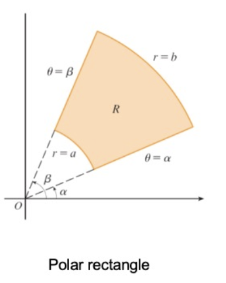
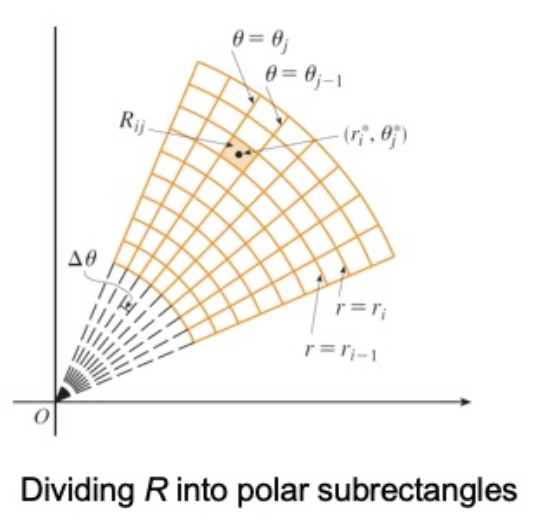
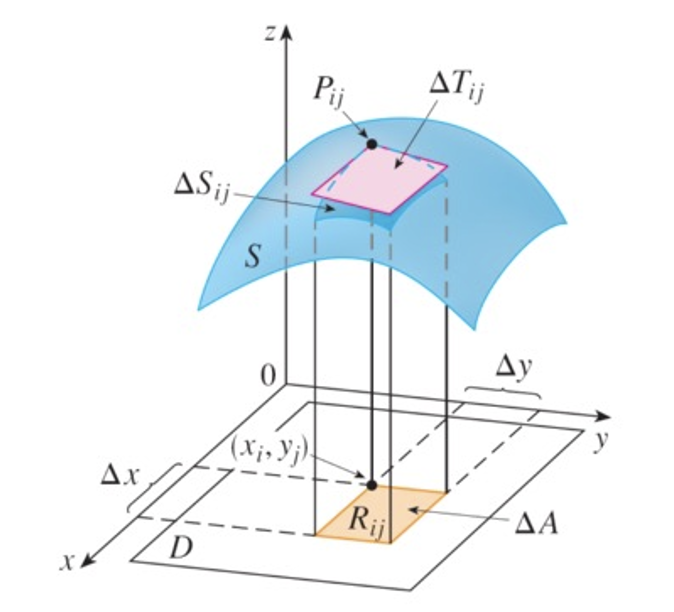
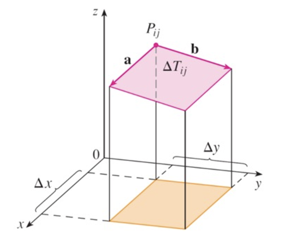
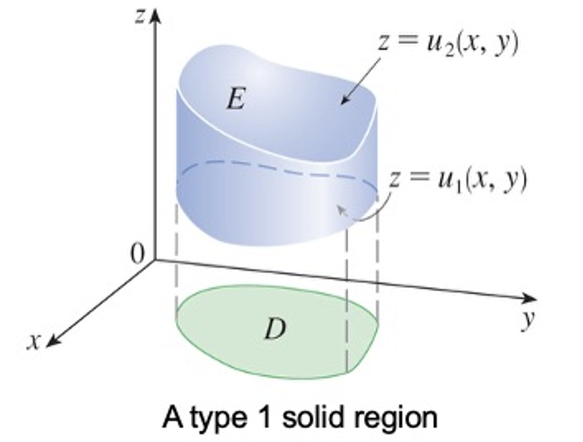
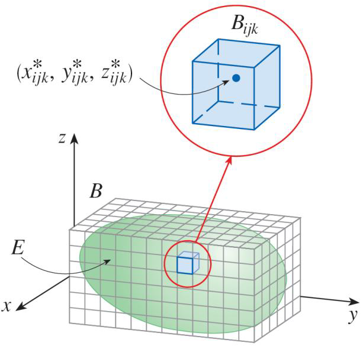
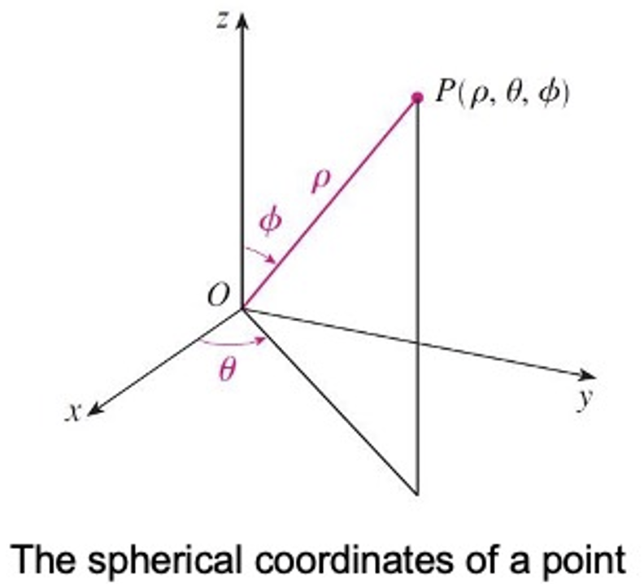
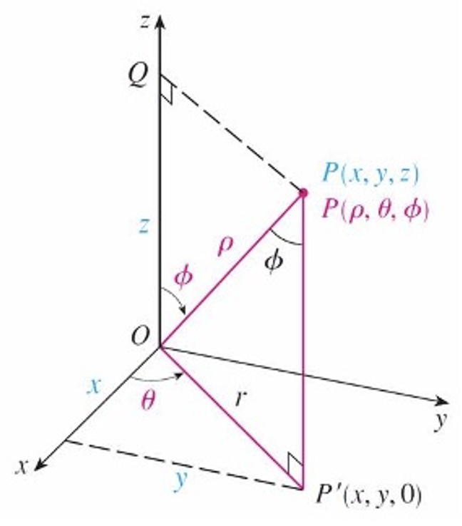
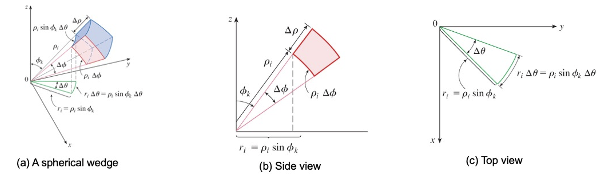

# Multiple Integrals

## Double Integrals over Rectangles

### Review of the Definite Integral

If $f(x)$ is defined for $a\le x\le b$, we start by dividing the interval $[a,b]$ into $n$ subintervals $[x_{i-1},x-i]$ of equal width $\Delta x=\frac{b-a}{n}$ and we choose sample points $x_i^*$ in these subintervals. Then we form the Riemann sum
$$
\sum_{i=1}^nf(x_i^*)\Delta x
$$
and take the limit of such sums as $n\to\infin$ to obtain the definite integral of $f$ from $a$ to $b$:
$$
\int_a^bf(x)dx=\lim_{n\to\infin}\sum_{i=1}^{n}f(x_i^*)\Delta x
$$

### Volumes and Double integrals

In a similar manner we consider a function $f$ of two variables defined on a closed rectangle
$$
R=[a,b]\times[c,d]= \left\{(x,y)\in\R^2\mid a\le x\le b,c\le y\le d \right\}
$$
and we first suppose that $f(x,y)\ge0$. The graph of $f$ is a surface with equation $z=f(x,y)$. Let $S$ be the solid that lies above $R$ and under the graph of $f$, that is
$$
S=\left\{ (x,y,z)\in\R^3\mid 0\le z\le f(x,y),(x,y)\in R \right\}
$$
Our goal is to find the volume of $S$. By drawing lines parallel to the coordinate axes through the endpoints of these subintervals, we form the subrectangles
$$
R_{ij}=[x_{i-1},x_i]\times[y_{j-1},y_j]=\left\{ (x,y)\mid x_{i-1}\le x\le x_i,y_{j-1}\le y\le y_j \right\}
$$
each with area $\Delta A=\Delta x\Delta y$. If we choose a **sample point** $(x_{ij}^*,y_{ij}^*)$ in each $R_{ij}$, then we can approximate the part of $S$ that lies above each $R_{ij}$ by a thin rectangular box with base $R_{ij}$ and height $f(x_{ij}^*,y_{ij}^*)$. The volume of this box is the height of the box times the area of the base rectangle:
$$
f(x_{ij}^*,y_{ij}^*)\Delta A
$$
lf we follow this procedure for all the rectangles and add the volumes of the corresponding boxes, we get an approximation to the total volume of $S$:
$$
V\approx \sum_{i=1}^{m}\sum_{j=1}^{n}f(x_{ij}^*,y_{ij}^*)\Delta A
$$
Our intuition tells us that the approximation becomes better as $m$ and $n$ become larger and so we would expect that
$$
V=\lim_{m,n\to\infin}\sum_{i=1}^{m}\sum_{j=1}^{n}f(x_{ij}^*,y_{ij}^*)\Delta A
$$
**Definition**: The **double integral** of $f$ over the rectangle $R$ is
$$
\iint_{R}f(x,y)dA=\lim_{m,n\to\infin}\sum_{i=1}^{m}\sum_{j=1}^{n}f(x_{ij}^*,y_{ij}^*)\Delta A
$$
if this limit exists. The precise meaning of the limit is that for every number $\varepsilon>0$ there is an integer $N$ such that
$$
\left| \iint_{R}f(x,y)dA-\sum_{i=1}^{m}\sum_{j=1}^{n}f(x_{ij}^*,y_{ij}^*)\Delta A \right|<\varepsilon
$$
for all integers $m$ and $n$ greater than $N$ and for any choice of sample points $(x_{ij}^*,y_{ij}^*)\in R_{ij}$. A function $f$ is called integrable if the limit exists.

The sum in the definition, 
$$
\sum_{i=1}^{m}\sum_{j=1}^{n}f(x_{ij}^*,y_{ij}^*)\Delta A
$$
is called a **double Riemann sum** and is used as an approximation to the value of the double integral.

### The Midpoint Rule

We use a double Riemann sum to approximate the double integral, where the sample point $(x_{ij}^*,y_{ij}^*)$ in $R_{ij}$ is chosen to be the center $(\bar{x}_i,\bar{y}_j)$ of $R_{ij}$. In other words, $\bar{x}_{i}$ is the midpoint of $[x_{i-1},x_i]$ and $\bar{y}_j$ is the midpoint of $[y_{j-1},y_j]$.

**Definition**: Midpoint Rule of Double Integrals
$$
\iint_{R}f(x,y)dA\approx\sum_{i=1}^{m}\sum_{j=1}^{n}f(\bar{x}_i,\bar{y}_{j})\Delta A
$$

### lterated Integrals

Suppose that $f$ is a function of two variables that is integrable on the rectangle $R=[a,b]\times[c,d]$. We use the notation $\int_c^df(x,y)dy$ to mean that $x$ is held fixed and $f(x,y)$ is integrated with respecte to $y$ from $y=c$ to $y=d$. This procedure is called partial integration with respect to $y$. Now $\int_c^df(x,y)dy$ is a number taht depends on the value of $x$, so it defines a function of $x$:
$$
A(x)=\int_c^df(x,y)dy
$$
If we now integrate the function $A$ with respect to $x$ from $x=a$ to $x=b$, we get
$$
\int_a^bA(x)dx=\int_a^b\left[ \int_c^d f(x,y)dy\right]dx
$$
The integral on the right side is called an **iterated integral**. Usually the brackets are omitted. Thus
$$
\int_a^b\int_c^df(x,y)dydx=\int_a^b\left[ \int_c^d f(x,y)dy\right]dx
$$
**Funbini's Theorem**: If $f$ is continuous on the rectangle
$$
R=\left\{ (x,y)\mid a\le x\le b,c\le y\le d\right\}
$$
then
$$
\iint_Rf(x,y)dA=\int_a^b\int_c^df(x,y)dydx=\int_c^d\int_a^bf(x,y)dxdy
$$

Suppose that $f(x,y)=g(x)h(y)$ and $R=[a,b]\times[c,d]$. Then Fubini's Theorem gives
$$
\iint_Rf(x,y)dA=\int_c^d\int_a^bg(x)h(y)dxdy=\int_c^d\left[ \int_a^bg(x)h(y)dx \right]dy
\\[5pt]
=\int_c^d\left[h(y)\left( \int_a^bg(x)dx\right) \right]=\int_a^bg(x)dx\int_c^dh(y)dy
$$

### Average Value

We define the **average value** of a function $f$ of two variables defined on a rectangle $R$ to be
$$
f_{\text{avg}}=\frac{1}{A(R)}\iint_Rf(x,y)dA
$$
where $A(R)$ is the area of $R$.

## Double Integrals over General Regions

### General Regions

We suppose that $D$ is a bounded region, which means that $D$ can be enclosed in a rectangular region $R$. In order to integrate a function $f$ over $D$ we define a new function $F$ with domain $R$ by
$$
F(x,y)=
\begin{cases}
f(x,y) & (x,y)\in D
\\[5pt]
0 & (x,y)\notin D \and (x,y)\in R
\end{cases}
$$
 If $F$ is integrable over $R$, then we define the **double integral of $f$ over $D$ **by 
$$
\iint_Df(x,y)dA=\iint_RF(x,y)dA
$$
A plane region $D$ is said to be of **type 1** if it lies between the graphs of two continuous functions of $x$, that is
$$
D=\left\{ (x,y) \mid a\le x\le b,g_1(x)\le y\le g_2(x) \right\}
$$
where $g_1$ and $g_2$ are continuous on $[a,b]$. By Fubini's Theorem, we have
$$
\iint_D f(x,y)dA=\iint_RF(x,y)dA=\int_a^b\int_c^dF(x,y)dydx
$$
Observe that $F(x,y)=0$ if $y<g_1(x)$ or $y>g_2(x)$ because $(x,y)$ then lies outside $D$. Therefore
$$
\int_c^dF(x,y)dy=\int_{g_1(x)}^{g_2(x)}F(x,y)dy=\int_{g_1(x)}^{g_2(x)}f(x,y)dy
$$
because $F(x,y)=f(x,y)$ when $g_1(x)\le y\le g_2(x)$. Therefore, we have
$$
\iint_Df(x,y)dA=\int_a^b\int_{g_1(x)}^{g_2(x)}f(x,y)dydx
$$
We also consider plane regions of **type 2**, which can be expressed as
$$
D=\left\{ (x,y) \mid c\le y\le d, h_1(y)\le x\le h_2(y) \right\}
$$
where $h_1$ and $h_2$ are continuous. The same as before, we have
$$
\iint_Df(x,y)dA=\int_c^d\int_{h_1(y)}^{h_2(y)}f(x,y)dxdy
$$

### Properties of Double Integrals

We assume that all of the following integrals exist. 
$$
\iint_D\left[ f(x,y)+g(x,y) \right]dA = \iint_Df(x,y)dA+\iint_Dg(x,y)dA
$$

$$
\iint_Dcf(x,y)dA = c\iint_Df(x,y)dA
$$

If $f(x,y)\ge g(x,y)$ for all $(x,y)\in D$, then
$$
\iint_Df(x,y)dA\ge \iint_Dg(x,y)dA
$$
If $D=D_1\cup D_2$, where $D_1$ and $D_2$ don't overlap except perhaps on their boundaries, then
$$
\iint_Df(x,y)dA=\iint_{D_1}f(x,y)dA+\iint_{D_2}f(x,y)dA
$$
If we integrate the constant function $f(x,y)=1$ over a region $D$, we get the area of $D$:
$$
\iint_D1dA=A(D)
$$
If $m\le f(x,y)\le M$ for all $(x,y)\in D$, then
$$
m\cdot A(D)\le \iint_Df(x,y)dA\le M\cdot A(D)
$$

## Double Integrals in Polar Coordinates

A **polar rectangle** could be expressed by the following equation:
$$
R=\left\{ (r,\theta)\mid a\le r\le b,\alpha\le \theta\le \beta \right\}
$$

In order to compute the double integral $\iint_Rf(x,y)dA$, where $R$ is a polar rectangle, we divide the interval $[a,b]$ into $m$ subintervals $[r_{i-1},r_i]$ of equal width $\Delta r=\frac{b-a}{m}$ and we divide the interval $[\alpha,\beta]$ into $n$ subintervals $[\theta_{j-1},\theta_j]$ of equal width $\Delta\theta=\frac{\beta-\alpha}{n}$. Then the circles $r=r_i$ and the rays $\theta=\theta_j$, divide the polar rectangle $R$ into the small polar rectangles $R_{ij}$.

The "center" of the polar subrectangle
$$
R_{ij}=\left\{ (r,\theta)\mid r_{i-1}\le r\le r_i,\theta_{j-1}\le\theta\le\theta_j \right\}
$$
has polar coordinates
$$
r_i^*=\frac{1}{2}(r_{i-1}+r_i)\quad \theta_j^*=\frac{1}{2}(\theta_{j-1}+\theta_j)
$$
We compute the area of $R_{ij}$ using the fact that the area of a sector of a circle with radius $r$ and central angle $\theta$ is $\frac{1}{2}r^2\theta$. Subtracting the areas of two such sectors, each of which has central angle $\Delta\theta=\theta_j-\theta_{j-1}$, we find that the area of $R_{ij}$ is
$$
\Delta A_{i}=\frac{1}{2}r_i^2\Delta\theta-\frac{1}{2}r_{i-1}^2\Delta\theta=r_i^*\Delta r\Delta\theta
$$
Although we have defined the double integral $\iint_Rf(x,y)dA$ in terms of ordinary rectangles, it can be shown that, for continuous functions $f$, we always obtain the same answer using polar rectangles.

The rectangular coordinates of the center of $R_{ij}$ are $(r_i^*\cos\theta_j^*,r_i^*\sin\theta_j^*)$, so a typical Riemann sum is
$$
\sum_{i=1}^{m}\sum_{j=1}^{n}f(r_i^*\cos\theta_j^*,r_i^*\sin\theta_j^*)\Delta A_i=\sum_{i=1}^{m}\sum_{j=1}^{n}(r_i^*\cos\theta_j^*,r_i^*\sin\theta_j^*)r_i^*\Delta r\Delta\theta
$$
If we write $g(r,\theta)=rf(r\cos\theta,r\sin\theta)$, then the Riemann sum can be written as
$$
\sum_{i=1}^{m}\sum_{j=1}^{n}g(r_i^*,\theta_j^*)\Delta r\Delta\theta
$$
which is a Riemann sum for the double integral
$$
\int_{\alpha}^{\beta}\int_a^bg(r,\theta)drd\theta
$$
Therefore we have
$$
\begin{aligned}
\iint_Rf(x,y)dA&=\lim_{m,n\to\infin}\sum_{i=1}^{m}\sum_{j=1}^{n}f(r_i^*\cos\theta_j^*,r_i^*\sin\theta_j^*)\Delta A_i
\\[5pt]
&= \lim_{m,n\to\infin}\sum_{i=1}^{m}\sum_{j=1}^{n}g(r_i^*,\theta_j^*)\Delta r\Delta\theta
\\[5pt]
&= \int_{\alpha}^{\beta}\int_{a}^{b}g(r,\theta)drd\theta
\\[5pt]
&=\int_{\alpha}^{\beta}\int_{a}^{b}f(r\cos\theta,r\sin\theta)rdrd\theta
\end{aligned}
$$
**Change to Polar Coordinates in a Double Integral**: If $f$ is continuous on a polar rectangle $R$ given by $0\le a\le r\le b$, $\alpha\le\theta\le\beta$, where $0\le\beta-\alpha\le2\pi$, then
$$
\iint_{R}f(x,y)dA=\int_{\alpha}^{\beta}\int_{a}^{b}f(r\cos\theta,r\sin\theta)rdrd\theta
$$
**Be careful not to forget the additional factor ron the right side.**

If $f$ is continuous on a polar region of the form
$$
D=\left\{ (r,\theta)\mid\alpha\le\theta\le\beta,h_1(\theta)\le r\le h_2(\theta) \right\}
$$
then
$$
\iint_{D}f(x,y)dA=\int_{\alpha}^{\beta}\int_{h_1(\theta)}^{h_2(\theta)}f(r\cos\theta,r\sin\theta)rdrd\theta
$$

## Applications of Double Integrals

### Density and Mass

We were able to use single integrals to compute moments and the center of mass of a thin plate or lamina with constant density.But now, equipped with the double integral, we can consider a lamina with variable density.
Suppose the lamina occupies a region $D$ of the $xy$-plane and its **density** (in units of mass per unit area) at a point $(x,y)$ in $D$ is given by $\rho(x,y)$, where $\rho$ is a continuous function on $D$. This means that
$$
\rho(x,y)=\lim\frac{\Delta m}{\Delta A}
$$
Where $\Delta m$ and $\Delta A$ are the mass and area of a small rectangle that contains $(x,y)$ and the limit is taken as the dimensions of the rectangle approach 0.

To find the total mass m of the lamina we divide a rectangle $R$ containing $D$ into subrectangles $R_{ij}$ of the same size and consider $\rho(x,y)$ to be 0 outside $D$. If we choose a point $(x_{ij}^*,j_{ij}^*)$ in $R_{ij}$, then the mass of the part of the laminate that occupies $R_{ij}$ is approximately $\rho(x_{ij}^*,y_{ij}^*)\Delta A$, where $\Delta A$ is the area of $R_{ij}$.

If we add all such masses, we get an approximation to the total mass:
$$
m\approx\sum_{i=1}^{k}\sum_{j=1}^{l}\rho(x_{ij}^*,y_{ij}^*)\Delta A
$$
If we now increase the number of subrectangles, we obtain the total mass $m$ of the lamina as the limiting value of the approximations:
$$
m=\lim_{k,l\to\infin}\sum_{i=1}^{k}\sum_{j=1}^{l}\rho(x_{ij}^*,y_{ij}^*)\Delta A=\iint_D\rho(x,y)dA
$$

### Moments and Centers of Mass

We know that we defined the moment of a particle about an axis as the product of its mass and its directed distance from the axis.We divide $D$ into small rectangles. Then the mass of $R_{ij}$ is approximately $\rho(x_{ij}^*,y_{ij}^*)\Delta A$, so we can approximate the moment of $R_{ij}$ with respect to the $x$-axis by
$$
\left[ \rho(x_{ij}^*,y_{ij}^*)\Delta A \right]y_{ij}^*
$$
If we now add these quantities and take the limit as the number of subrectangles becomes large, we obtain the **moment** of the entire laminate **about the $x$-axis**:
$$
M_x=\lim_{m,n\to\infin}\sum_{i=1}^{m}\sum_{j=1}^{n}y_{ij}^*\rho(x_{ij}^*,y_{ij}^*)\Delta A=\iint_Dy\rho(x,y)dA
$$
Similarly, the **moment about the $y$-axis** is
$$
M_y=\lim_{m,n\to\infin}\sum_{i=1}^{m}\sum_{j=1}^{n}x_{ij}^*\rho(x_{ij}^*,y_{ij}^*)\Delta A=\iint_Dx\rho(x,y)dA
$$

As before, we define the center of mass $(\bar{x},\bar{y})$ so that $m\bar{x}=M_y$, and $m\bar{y}=M_x$. Therefore, the coordinates $(\bar{x},\bar{y})$ of the center of mass of a laminate occupytin the region $D$ and having density function $\rho(x,y)$ are
$$
\bar{x}=\frac{M_y}{m}=\frac{1}{m}\iint_Dx\rho(x,y)dA
\\[5pt]
\bar{y}=\frac{M_x}{m}=\frac{1}{m}\iint_Dy\rho(x,y)dA
$$
where the mass $m$ is given by
$$
m=\iint_D\rho(x,y)dA
$$

### Moment of Inertia

The **moment of inertia** (also called the **second moment**) of a particle of mass  $m$ about an axis is defined to be $mr^2$, where $r$ is the distance from the particle to the axis. We extend this concept to a lamina with density function $\rho(x,y)$ and occupying a region $D$ by proceeding as we did for ordinary moments. 

We divide $D$ into small rectangles, approximate the moment of inertia of each subrectangle about the *x*-axis, and take the limit of the sum as the number of subrectangles becomes large.

The result is the **moment of inertia** of the laminate **about the $x$-axis**:
$$
I_x=\lim_{m,n\to\infin}\sum_{i=1}^{m}\sum_{j=1}^{n}(y_{ij}^*)^2\rho(x_{ij}^*,y_{ij}^*)\Delta A=\iint_Dy^2\rho(x,y)dA
$$
Similarly, the **moment of inertia about the $y$-axis** is
$$
I_y=\lim_{m,n\to\infin}\sum_{i=1}^{m}\sum_{j=1}^{n}(x_{ij}^*)^2\rho(x_{ij}^*,y_{ij}^*)\Delta A=\iint_Dx^2\rho(x,y)dA
$$
It is also of interest to consider the **moment of inertia about the origin**, also called the **polar moment of inertia:** 
$$
I_0=\lim_{m,n\to\infin}\sum_{i=1}^{m}\sum_{j=1}^{n}\left[ (x_{ij}^{*})^2+(y_{ij}^{*})^2 \right]\rho(x_{ij}^*,y_{ij}^*)\Delta A=\iint_{D}(x^2+y^2)\rho(x,y)dA=I_x+I_y
$$
We can derive the moments of inertia $I_x$, $I_y$, and $I_0$ of a homogeneous disk $D$ with density $\rho(x,y)=\rho$, enter the origin, and radius $a$, which is $I_0=\frac{\pi\rho a^4}{2}=\frac{ma^2}{2}$. Thus if we increase the mass or the radius of the disk, we thereby increase the moment of inertia.

In general, the moment of inertia plays much the same role in rotational motion that mass plays in linear motion. The moment of inertia of a wheel is what makes it difficult to start or stop the rotation of the wheel, just as the mass of a car is what makes it difficult to start or stop the motion of the car.

The **radius of gyration of a lamina about an axis** is the number $R$ such that
$$
mR^2=I
$$
Where $m$ is the mass of the lamina, $I$ is the moment of inertia about the given axis. If the mass of the lamina were concentrated at a distance $R$ from the axis, then the moment of inertia of this “point mass” would be the same as the moment of inertia of the lamina.

In particular, the radius of gyration $\bar{\bar{y}}$ with respect to the $x$-axis and the radius of gyration $\bar{\bar{x}}$ with respect to the $y$-axis are given by the equations
$$
m\bar{\bar{y}}^2=I_x\qquad m\bar{\bar{x}}^2=I_y
$$
Thus $(\bar{\bar{x}},\bar{\bar{y}})$ is the point at which the mass of the lamina can be concentrated without changing the moments of inertia with respect to the coordinate axes. 

### Surface Area

Let $S$ be a surface with equation $z=f(x,y)$, where $f$ has continuous partial derivatives. For simplicity in deriving the surface area formula, we assume that $f(x,y)\ge0$ and the domain $D$ of $f$ is a rectangle. We divide $D$ into small rectangles $R_{ij}$ with area $\Delta A=\Delta x\Delta y$. If $(x_i,y_j)$ is the corner of $R_{ij}$ closest to the origin, let $P_{ij}(x_i,y_j,f(x_i,y_j))$ be the point on $S$ directly above it.

The tangent plane to $S$ at $P_{ij}$ is an approximation to $S$ near $P_{ij}$. So the area $\Delta T_{ij}$ of the part of this tangent plane (a parallelogram) that lies directly above $R_{ij}$ is an approximation to the area $\Delta S_{ij}$ of the part of $S$ that lies directly above $R_{ij}$. Thus the sum $\sum\sum\Delta T_{ij}$ is an approximation to the total area of $S$, and this approximation appears to improve as the number of rectangles increases. Therefore, we define the **surface area** of $S$ to be
$$
A(S)=\lim_{m,n\to\infin}\sum_{i=1}^{m}\sum_{j=1}^{n}\Delta T_{ij}
$$
To find a formula taht is more convenient for computational purposes, we let $\boldsymbol{a}$ and $\boldsymbol{b}$ be the vectors that start at $P_{ij}$ and lie along the sides of the parallelogram with area $\Delta T_{ij}$.

Then $\Delta T_{ij}=|\boldsymbol{a}\times\boldsymbol{b}|$. We know taht $f_x(x_i,y_j)$ and $f_y(x_i,y_j)$ are the slopes of the tangent lines through $P_{ij}$ in the directions of $\boldsymbol{a}$ and $\boldsymbol{b}$. Therefore
$$
\boldsymbol{a}=\Delta x\boldsymbol{i}+f_x(x_i,y_j)\Delta x\boldsymbol{k}
\\[5pt]
\boldsymbol{b}=\Delta y\boldsymbol{j}+f_y(x_i,y_j)\Delta y\boldsymbol{k}
$$
and
$$
\begin{aligned}
\boldsymbol{a}\times\boldsymbol{b}&=\det\begin{bmatrix}
\boldsymbol{i} & \boldsymbol{j} & \boldsymbol{k}
\\
\Delta x & 0 & f_x(x_i,y_j)\Delta x
\\
0 & \Delta y & f_y(x_i,y_j)\Delta y
\end{bmatrix}
\\[5pt]
&= -f_x(x_i,y_j)\Delta x\Delta y\boldsymbol{i}-f_y(x_i,y_j)\Delta x\Delta y\boldsymbol{h}+\Delta x\Delta y\boldsymbol{k}
\\[10pt]
&=\left[ -f_x(x_i,y_j)\boldsymbol{i}-f_y(x_i,y_j)\boldsymbol{j}+\boldsymbol{k} \right]\Delta A
\\[10pt]
\end{aligned}
$$
Thus
$$
\Delta T_{ij}=|\boldsymbol{a}\times\boldsymbol{b}|=\sqrt{[f_x(x_i,y_j)]^2+[f_y(x_i,y_j)]^2+1}\;dA
$$
**Definition**: The area of the surface with equation $z=f(x,y),\;(x,y)\in D$, where $f_x$ and $f_y$ are continuous, is
$$
\begin{aligned}
A(S)&=\iint_D\sqrt{[f_x(x,y)]^2+[f_y(x,y)]^2+1}\;dA
\\[5pt]
&=\iint_D\sqrt{1+\left( \frac{\partial z}{\partial x} \right)^2 + \left( \frac{\partial z}{\partial y} \right)^2}\;dA
\end{aligned}
$$
We can transform the function in the polar coordinate, meaning that $z=g(r,\theta),(r,\theta)\in D$, where $g_r$ and $g_{\theta}$ are continuous:
$$
\begin{aligned}
A(S)&=\iint_D\sqrt{1+\left( \frac{\partial z}{\partial r} \right)^2+\left( \frac{\partial z}{\partial \theta} \right)^2}\;dA
\\[5pt]
&=\iint_D\sqrt{1+\left( \frac{\partial z}{\partial r} \right)^2+\left( \frac{\partial z}{\partial \theta} \right)^2}\;rdrd\theta
\end{aligned}
$$

## Triple Integrals

We have defined single integrals for functions of one variable and double integrals for functions of two variables, so we can define triple integrals for functions of three variables.

### Triple Integrals over Rectangular Boxes

Let's first deal with the simplest case where $f$ is defined on a rectangular box:
$$
B=\left\{ (x,y,z) \mid a\le x\le b,c\le y\le d,r\le z\le s \right\}
$$
The first step is to divide $B$ into sub-boxes. We do this by dividing the interval $[a,b]$ into $l$ subintervals $[x_{i-1},x_i]$ of equal width $\Delta x$, dividing $[c,d]$ into $m$ subintervals of width $\Delta y$, and dividing $[r,s]$ into $n$ subintervals of width $\Delta z$.

The planes through the endpoints of these subintervals parallel to the coordinate planes divide the box $B$ into $lmn$ sub-boxes
$$
B_{ijk}=[x_{i-1},x_i]\times[y_{j-1},y_j]\times[z_{k-1},z_k]
$$
Each sub-box has volume $\Delta V=\Delta x\Delta y\Delta z$. Then we have the **triple Riemann sum**
$$
\sum_{i=1}^{l}\sum_{j=1}^{m}\sum_{k=1}^{n}f(x_{ijk}^*,y_{ijk}^*,z_{ijk}^*)\Delta V
$$
where the sample point $(x_{ijk}^*,y_{ijk}^*,z_{ijk}^*)$ is in $B_{ijk}$.

**Definition**: The **triple integral** of $f$ over the box $B$ is
$$
\begin{aligned}
\iiint_Bf(x,y,z)dV&=\lim_{l,m,n\to\infin}\sum_{i=1}^{l}\sum_{j=1}^{m}\sum_{k=1}^{n}f(x_{ijk}^*,y_{ijk}^*,z_{ijk}^*)\Delta V
\\[5pt]
&=\lim_{l,m,n\to\infin}\sum_{i=1}^{l}\sum_{j=1}^{m}\sum_{k=1}^{n}f(x_i,y_j,z_k)\Delta V
\end{aligned}
$$
if this limit exists. Again, the triple integral always exists if $f$ is continuous.

**Fubini's Theorem for Triple Integrals**: If $f$ is continuous on the rectangular box $B=[a,b]\times[c,d]\times[r,s]$, then
$$
\iiint_Bf(x,y,z)dV=\int_r^s\int_c^d\int_a^bf(x,y,z)dxdydz
$$
The order of the three integration could be randomly changed.

### Triple Integrals over General Regions

Now we define the **triple integral over a general bounded region $E$** in three-dimensional space (a solid) by much the same procedure that we used for double integrals.

A solid region $E$ is said to be of **type 1** if it lies between the graphs of two continuous functions of $x$ and $y$, that is
$$
E=\{ (x,y,z)\mid (x,y)\in D,u_1(x,y)\le z\le u_2(x,y) \}
$$
where $D$ is the projection of $E$ onto the $xy$-plane.

Notice that the upper boundary of the solid $E$ is the surface with equation $z=u_2(x,y)$, while the lower boundary is the surface $z=u_1(x,y)$. By the same sort of argument, it can be shown that if $E$ is a type 1 region, then
$$
\iiint_Ef(x,y,z)dV=\iint_D\left[ \int_{u_1(x,y)}^{u_2(x,y)}f(x,y,z)dz \right]dA
$$
The meaning of the inner integral on the right side is that $x$ and $y$ are held fixed, the therefore $u_1(x,y)$ and $u_2(x,y)$ are regarded as constants, while $f(x,y,z)$ is integrated with respect to $z$.

In particular, if the projection $D$ of $E$ onto the $xy$-plane is a type 1 plane region. Then
$$
E=\{ (x,y,z)\mid a\le x\le b,g_1(x)\le y\le g_2(x),u_1(x,y)\le z\le u_2(x,y) \}
$$
and the equation becomes
$$
\iiint_Ef(x,y,z)dV=\int_a^b\int_{g_1(x)}^{g_2(x)}\int_{u_1(x,y)}^{u_2(x,y)}f(x,y,z)dzdydx
$$
If, on the other hand, $D$ is a type 2 plane region, then
$$
E=\{ (x,y,z)\mid c\le y\le d,h_1(y)\le x\le h_2(y),u_1(x,y)\le z\le u_2(x,y) \}
$$
and the equation becomes
$$
\iiint_Ef(x,y,z)dV=\int_c^d\int_{h_1(y)}^{h_2(y)}\int_{u_1(x,y)}^{u_2(x,y)}f(x,y,z)dzdxdy
$$
A solid region $E$ is of **type 2** if it is of the form
$$
E=\{ (x,y,z)\mid (y,z)\in D,u_1(y,z)\le x\le u_2(y,z) \}
$$
where, this time, $D$ is the projection of $E$ onto the $yz$-plane. Everything is the same as before.

### Applications of Triple Integrals

We know that if $f(x)\ge0$, then the single integral $\int_a^bf(x)dx$ represents the area under the curve $y=f(x)$ from $a$ to $b$, and if $f(x,y)\ge0$, then the double integral $\iint_Df(x,y)dA$ represents the volume under the surface $z=f(x,y)$ and above $D$.

The corresponding interpretation of a triple integral $\iiint_Ef(x,y,z)dV$, where $f(x,y,z)\ge0$, is not very useful because it would be the “hypervolume” of a four-dimensional object and, of course, that is very difficult to visualize.

Let's begin with the special case where $f(x,y,z)=1$ for all points in $E$. Then the triple integral does represent the volume of $E$:
$$
V(E)=\iiint_EdV
$$
Suppose that a solid object occupying a region $E$ has density $\rho(x,y,z)$, in units of mass per unit volume, at any given point $(x,y,z)$ in $E$. To find the total mass $m$ of $E$ we divide a rectangular box $B$ containing $E$ into sub-boxes $B_{ijk}$ of the same size, and consider $\rho(x,y,z)$ to be 0 outside $E$.

$$
m=\lim_{l,m,n\to\infin}\sum_{i=1}^{l}\sum_{j=1}^{m}\sum_{k=1}^{n}\rho(x_{ijk}^*,y_{ijk}^*,z_{ijk}^*)\Delta V=\iiint_E\rho(x,y,z)dV
$$
Similarly, the **moments** of $E$ about the three coordinate planes are
$$
M_{yz}=\iiint_Ex\rho(x,y,z)dV
\\[5pt]
M_{xz}=\iiint_Ey\rho(x,y,z)dV
\\[5pt]
M_{xy}=\iiint_Ez\rho(x,y,z)dV
$$
The **center of mass** is located at the point $(\bar{x},\bar{y},\bar{z})$, where
$$
\bar{x}=\frac{M_{yz}}{m}\quad\bar{y}=\frac{M_{xz}}{m}\quad\bar{z}=\frac{M_{xy}}{m}
$$
If the density is constant, the center of mass of the solid is called the **centroid** of $E$.

The **moment of inertia** about the three coordinate axes are
$$
I_x=\iiint_E(y^2+z^2)\rho(x,y,z)dV
\\[5pt]
I_y=\iiint_E(x^2+z^2)\rho(x,y,z)dV
\\[5pt]
I_z=\iiint_E(x^2+y^2)\rho(x,y,z)dV
$$

## Triple Integrals in Spherical Coordinates

### Spherical Cordinates

Another useful coordinate system in three dimensions is the spherical coordinate system. It simplifies the evaluation of triple integrals over regions bounded by spheres or cones.

The **spherical coordinates** $(\rho,\theta,\phi)$ of a point $P$ in space are shown in the figure where $\rho=|OP|$ is the distance from the origin to $P$, $\theta$ is the same angle as in cylindrical coordinates, and $\phi$ is the angle between the positive $z$-axis and the line segment $OP$.

Note that $\rho\ge0$ and $0\le\phi\le\pi$ and $0\le\theta\lt 2\pi$. 

The relationship between rectangular and spherical coordinates can be seen from the figure. From triangles $OPQ$ and $OPP'$ we have
$$
z=\rho\cos\phi\quad r=\rho\sin\phi
$$

Also, $x=r\cos\theta$ and $y=r\sin\theta$, so to convert from spherical to rectangular coordinates, we use the equations
$$
x=\rho\sin\phi\cos\theta\qquad y=\rho\sin\phi\sin\theta\qquad z=\rho\cos\phi
$$
The distance formula shows that $x^2+y^2+z^2=\rho^2$.

### Triple Integrals in Spherical Coordinates

In the spherical coordinate system the counterpart of a rectangular box is a **spherical wedge**
$$
E=\{ (\rho,\theta,\phi)\mid a\le\rho\le b,\alpha\le\theta\le\beta,c\le \phi\le d \}
$$
where $a\ge0$ and $\beta-\alpha\lt2\pi$ and $d-c\le\pi$. We divide $E$ into smaller wedges $E_{ijk}$ by means of equally spaced spheres $\rho=\rho_i$, half-planes $\theta=\theta_j$, and half-cones $\phi=\phi_k$.

By projection and analysis, an approximation to the volume of $E_{ijk}$ is given by
$$
\Delta V_{ijk}\approx(\Delta\rho)(\rho_i\Delta \phi)(\rho_i\sin\phi_k\Delta\theta)=\rho_i^2\sin\phi_k\Delta\rho\Delta\theta\Delta\phi
$$
In fact, it can be shown, with the aid of the Mean Value Theorem, that the volume of $E_{ijk}$ is given exactly by
$$
\Delta V_{ijk}=\tilde{\rho}_i^2\sin\tilde{\phi}_k\Delta\rho\Delta\theta\Delta\phi
$$
where $(\tilde{\rho}_i,\tilde{\theta}_j,\tilde{\phi}_k)$ is some point in $E_{ijk}$. Let $(x_{ijk}^*,y_{ijk}^*,z_{ijk}^*)$ be the rectangular coordinates of this point. Then
$$
\begin{aligned}
&\iiint_Ef(x,y,z)dV
\\
=&\lim_{l,m,n\to\infin}\sum_{i=1}^{l}\sum_{j=1}^{m}\sum_{k=1}^{n}f(x_{ijk}^*,y_{ijk}^*,z_{ijk}^*)\Delta V
\\[5pt]
=&\lim_{l,m,n\to\infin}\sum_{i=1}^{l}\sum_{j=1}^{m}\sum_{k=1}^{n}f(\tilde{\rho}_i\sin\tilde{\phi}_k\cos\tilde{\theta}_j,\tilde{\rho}_i\sin\tilde{\phi}_k\sin\tilde{\theta}_j,\tilde{\rho}_i\cos\tilde{\phi}_k)\tilde{\rho}_i^2\sin\tilde{\phi}_k\Delta\rho\Delta\theta\Delta\phi
\end{aligned}
$$
Consequently, we have arrived at **the following formula for triple integration in spherical coordinates**.
$$
\iiint_Ef(x,y,z)dV=\int_c^d\int_\alpha^\beta\int_a^bf(\rho\sin\phi\cos\theta,\rho\sin\phi\sin\theta,\rho\cos\phi)\rho^2\sin\phi d\rho d\theta d\phi
$$
where $E$ is a spherical wedge given by
$$
E=\{ (\rho,\theta,\phi)\mid a\le\rho\le b,\alpha\le\theta\le\beta,c\le \phi\le d \}
$$

## Change of Variables in Multiple Integrals

### Change of Variables in Double Integrals

We consider a change of variables that is given by a **transformation** $T$ from the $uv$-plane to the $xy$-plane:
$$
T(u,v)=(x,y)
$$
where $x$ and $y$ are related to $u$ and $v$ by the equations
$$
x=g(u,v)\qquad y=h(u,v)
$$
We usually assume that $T$ is a $C^1$ **transformation**, which means taht $g$ and $h$ have continuous first-order partial derivatives. A transformation $T$ is really just a function whose domain and range are both subsets of $\R^2$.

If $T(u_1,v_1)=(x_1,y_1)$, then the point $(x_1,y_1)$ is called the **image** of the point $(u_1,v_1)$. If no two points have the same image, $T$ is called **one-to-one**. $T$ transforms $S$ into a region $R$ in the $xy$-plane called the **image of $S$**, consisting of the images of all points in $S$.

If $T$ is a one-to-one transformation, then it has an **inverse transformation** $T^{-1}$.from the $xy$-plane to the $uv$-plane and it may be possible to solve the equation for $u$ and $v$ in terms of $x$ and $y$:
$$
u=G(x,y)\qquad v=H(x,y)
$$
Now let's see how a change of variables affects a double integral. We start with a small rectangle $S$ in the $uv$-plane whose lower left corner is the point $(u_0,v_0)$ and whose dimensions are $\Delta u$ and $\Delta v$.

The image of $S$ is a region $R$ in the $xy$-plane, one of whose boundary points is $(x_0,y_0)=T(u_0,v_0)$. The vector
$$
\boldsymbol{r}(u,v)=g(u,v)\boldsymbol{i}+h(u,v)\boldsymbol{j}
$$
is the position vector of the image of the point $(u,v)$. The equation of the lower side of $S$ is $v=v_0$, whose image curve is given by the vector function $\boldsymbol{r}(u,v_0)$.

The tangent vector at $(x_0,y_0)$ to this image curve is
$$
\boldsymbol{r}_u=g_u(u_0,v_0)\boldsymbol{i}+h_u(u_0,v_0)\boldsymbol{j}=\frac{\partial x}{\partial u}\boldsymbol{i}+\frac{\partial y}{\partial u}\boldsymbol{j}
\\[5pt]
\boldsymbol{r}_v=g_v(u_0,v_0)\boldsymbol{i}+h_v(u_0,v_0)\boldsymbol{j}=\frac{\partial x}{\partial v}\boldsymbol{i}+\frac{\partial y}{\partial v}\boldsymbol{j}
$$
Therefore we can approximate the area of $R$, which is
$$
|(\Delta u\;\boldsymbol{r}_u)\times(\Delta v\;\boldsymbol{r}_v)|=|\boldsymbol{r}_u\times\boldsymbol{r}_v|\Delta u\Delta v
$$
Computing the cross product, we obtain
$$
\boldsymbol{r}_u\times\boldsymbol{r}_v=
\begin{vmatrix}
\boldsymbol{i} & \boldsymbol{j} & \boldsymbol{k}
\\
\frac{\partial x}{\partial u} & \frac{\partial y}{\partial u} & 0
\\
\frac{\partial x}{\partial v} & \frac{\partial y}{\partial v} & 0
\end{vmatrix}
=
\begin{vmatrix}
\frac{\partial x}{\partial u} & \frac{\partial y}{\partial u}
\\
\frac{\partial x}{\partial v} & \frac{\partial y}{\partial v}
\end{vmatrix}
\boldsymbol{k}
=
\begin{vmatrix}
\frac{\partial x}{\partial u} & \frac{\partial x}{\partial v}
\\
 \frac{\partial y}{\partial u} & \frac{\partial y}{\partial v}
\end{vmatrix}
\boldsymbol{k}
=\frac{\partial(x,y)}{\partial (u,v)}\boldsymbol{k}
$$
Therefore, we have
$$
\Delta A\approx\left| \frac{\partial(x,y)}{\partial (u,v)} \right|\Delta u\Delta v
$$
where the Jacobian is evaluated at $(u_0,v_0)$.

Applying the approximation to each $R_{ij}$, we approximate the double integral of $f$ over $R$ as follows:
$$
\begin{aligned}
\iint_Rf(x,y)dA&\approx\sum_{i=1}^{m}\sum_{j=1}^{n}f(x_i,y_j)\Delta A
\\[5pt]
&\approx\sum_{i=1}^{m}\sum_{j=1}^{n}f\left( g(u_i,v_j),h(u_i,v_j) \right)\left| \frac{\partial(x,y)}{\partial(u,v)} \right|\Delta u\Delta v
\end{aligned}
$$
where the Jacobian is evaluated at $(u_i,v_j)$. Notice that this double sum is a Riemann sum for the integral
$$
\iint_Sf(g(u,v),h(u,v))\left| \frac{\partial(x,y)}{\partial(u,v)} \right|dudv
$$
**Change of Variables in a Double Integral**: Suppose that $T$ is a $C^1$ transformation whose Jacobian is nonzero and that $T$ maps a region $S$ in the $uv$-plane onto a region $R$ in the $xy$-plane. Suppose that $f$ is continuous on $R$ and that $R$ and $S$ are type 1 or type 2 plane regions. Suppose also that $T$ is one-to-one, except perhaps on the boundary of $S$. Then
$$
\iint_Rf(x,y)dA=\iint_Sf(x(u,v),y(u,v))\left| \frac{\partial(x,y)}{\partial(u,v)} \right|dudv
$$

### Change of Variables in Triple Integrals

There is a similar change of variables formula for triple integrals. Let $T$ be a one-to-one transormation that maps a region $S$ in $uvw$-plane onto a region $R$ in $xyz$-space by means of the equations
$$
x=g(u,v,w)\quad y=h(u,v,w)\quad z=k(u,v,w)
$$
The **Jacobian** of $T$ is the following $3\times3$ determinant:
$$
\frac{\partial (x,y,z)}{\partial (u,v,w)}=
\begin{vmatrix}
\frac{\partial x}{\partial u} & \frac{\partial x}{\partial v} & \frac{\partial x}{\partial w}
\\
\frac{\partial y}{\partial u} & \frac{\partial y}{\partial v} & \frac{\partial y}{\partial w}
\\
\frac{\partial z}{\partial u} & \frac{\partial z}{\partial v} & \frac{\partial z}{\partial w}
\end{vmatrix}
$$
We have the following formula for triple integrals:
$$
\iiint_Rf(x,y,z)dV=\iiint_Sf(x(u,v,w),y(u,v,w),z(u,v,w))\left| \frac{\partial (x,y,z)}{\partial (u,v,w)} \right|dudvdw
$$
