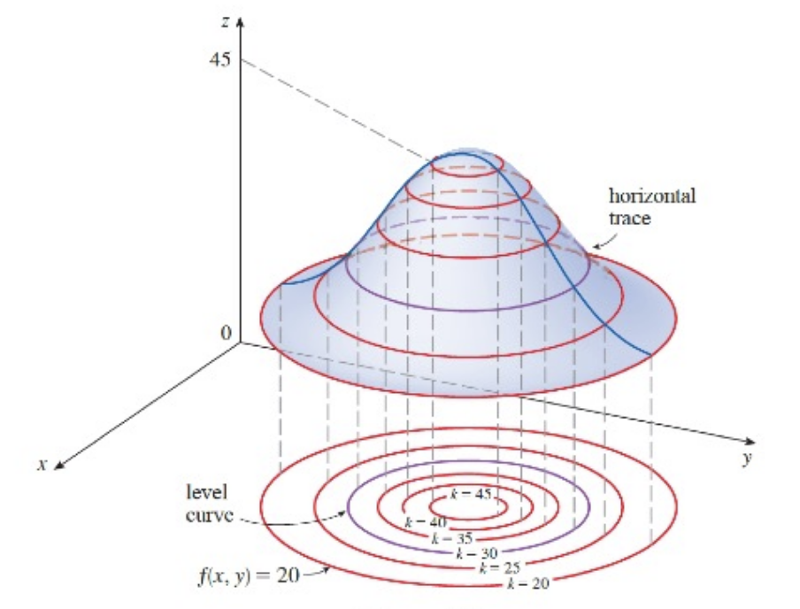

# Partial Derivatives

## Functions of Several Variables

### Functions of Two Variables

**Definition**: A function $f$ of two variables is a rule that assigns to each ordered pair of real numbers $(x,y)$ in a set $D$ a unique real number denoted by $f(x,y)$. The set $D$ is the **domain** of $f$ and its **range** is the set of values taht $f$ takes on , that is, $\{f(x,y)\mid (x,y)\in D\}$.

We often write $z=f(x,y)$ to make explicit the value taken on by $f$ at the general point $(x,y)$. The variables $x$ and $y$ are **independent variables** and $z$ ia the **dependent variable** 

### Graphs

**Definition**: If $f$ is a function of two variables with domain $D$, then the **graph** of $f$ is the set of all points $(x,y,z)$ in $\R^3$ such that $z=f(x,y)$ and $(x,y)$ is in $D$. The graph of a function $f$ of two variables is a surface $S$ with equation $z=f(x,y)$.

The function $f(x,y)=ax+by+c$ is called as a **linear function**. The graph of such a function has the equation
$$
z=ax+by+c\quad\text{or}\quad ax+by-z+c=0
$$
so it's a plane. In much the same way that linear functions of one variable are important in single-variable calculus, we will see that linear functions of two variables play a central role in multivariable calculus.

### Level Curves and Contour Maps

**Definition**: The **level curves** of a function $f$ of two variables are the curves with the equations $f(x,y)=k$, where $k$ is a constant (in the range of $f$).

A level curve $f(x,y)=k$ is the set of all points in the domain of $f$ at which $f$ takes on a given value $k$. In other words, it's a curve in the xy-plane that shows where the graph of $f$ has height $k$ (above or below the xy-plane). A collection of level curves is called a **contour map**.

###  Functions of Three or More Variables

A **function of three variables**, $f$, is a rule that assigns to each ordered triple $(x,y,z)$ in a domain $D\sub\R^3$ a unique real number denoted by $f(x,y,z)$. We can gain some insight into $f$ by examining its **level surfaces**, which are the surfaces with equations $f(x,y,z)=k$, where $k$ is a constant. If the point $(x,y,z)$ moves along a level surface, the value of $f(x,y,z)$ remains fixed.

Functions of any number of variables can be considered. A **function of $n$ variables** is a rule taht assigns a number $z=f(x_1,x_2,\dots,x_n)$ to an n-tuple $(x_1,x_2,\dots,x_n)$ of real numbers. Sometimes we use vector notation to write such functions more compactly: If $\boldsymbol{x}=\langle x_1,x_2,\dots,x_n\rangle$, we often write $f(\boldsymbol{x})$ in place of $f(x_1,x_2,\dots,x_n)$. With this notation we can rewrite the function as
$$
f(\boldsymbol{x})=\boldsymbol{c}\cdot\boldsymbol{x}
$$
where $\boldsymbol{c}=\langle c_1,c_2,\dots,c_n \rangle$ and $\boldsymbol{c}\cdot\boldsymbol{x}$ denotes the dot product of the vectors $\boldsymbol{c}$ and $\boldsymbol{x}$ in $V_n$.

## Limits

### Limits of Functions of Two Variables

Let $f$ be a function of two variables whose domain $D$ includes points arbitrarily close to $(a,b)$. Then we say that the **limit of $f(x,y)$ as $(x,y)$ approaches $(a,b)$** is $L$ and we write
$$
\lim_{(x,y)\to(a,b)}f(x,y)=L
$$
if for every number $\varepsilon>0$ there is a corresponding number $\delta>0$ such that
$$
\text{if }(x,y)\in D\quad\text{and}\quad 0<\sqrt{(x-a)^2+(y-b)^2}<\delta\quad\text{then}\quad|f(x,y)-L|<\varepsilon
$$

### Showing that a Limit doesn't exist

One way to show that $\lim_{(x,y)\to(a,b)}f(x,y)$ does not exist is to find different paths of approach along which the function has different limits.

If $f(x,y)\to L_1$ as $(x,y)\to(a,b)$ along a path $C_1$ and $f(x,y)\to L_2$ as $(x,y)\to(a,b)$ along a path $C_2$, where $L_1\ne L_2$, then $\lim_{(x,y)\to(a,b)}f(x,y)$ does not exist.

### Properties of Limits

The Limit Laws can be extended to functions of two variables. Assuming that the indicated limits exist, we can state these laws verbally as follows:

| Law                   | Description                                                  |
| --------------------- | ------------------------------------------------------------ |
| Sum Law               | The limit of a sum is the sum of the limits.                 |
| Difference Law        | The limit of a difference is the difference of the limits.   |
| Constant Multiple Law | The limit of a constant times a function is the constant times the limit of the function. |
| Product Law           | The limit of a product is the product of the limits.         |
| Quotient Law          | The limit of a quotient is the quotient of the limits (the limit of the denominator is not 0) |

### Continuity

A function $f$ of two variables is called **continuous at** $(a,b)$ if
$$
\lim_{(x,y)\to(a,b)}f(x,y)=f(a,b)
$$
We say $f$ is **continuous on** $D$ if $f$ is continuous at every point $(a,b)$ in $D$.

## Partial Derivative

### Partial Derivatives of Functions of Two Variables

In general, if $f$ is a function of two variables $x$ and $y$, suppose we let only $x$ vary while keeping $y$ fixed, say $y=b$, where $b$ is a constant.

Then we are really considering a function of a single variable $x$, namely, $g(x)=f(x,b)$. If $g$ has a derivative at $a$, then we call it the **partial derivative of $f$ with respect to $x$ at $(a,b)$** and denote it by $f_x(a,b)$. Thus
$$
f_x(a,b)=g'(a)\quad\text{where}\quad g(x)=f(x,b)
$$
Similarly, the **partial derivative of fwith respect to $y$ at $(a,b)$**, denoted by $f_y(a,b)$, is obtained by keeping $x$ fixed $(x= a)$ and finding the ordinary derivative at $b$ of the function $G(y)=f(a,y)$:
$$
f_y(a,b)=\lim_{h\to0}\frac{f(a,b+h)-f(a,b)}{h}
$$
**Definition**: If $f$ is a function of two variables, its **partial derivatives** are the functions $f_x$ and $f_y$ defined by
$$
f_x(x,y)=\lim_{h\to0}\frac{f(x+h,y)-f(x,y)}{h}
\\[5pt]
f_y(x,y)=\lim_{h\to0}\frac{f(x,y+h)-f(x,y)}{h}
$$
If $z=f(x,y)$, we can use other notations:
$$
f_x(x,y)=f_x=\frac{\partial f}{\partial x}=\frac{\partial}{\partial x}f(x,y)=\frac{\partial z}{\partial x}=f_1=D_1f=D_xf
\\[5pt]
f_y(x,y)=f_y=\frac{\partial f}{\partial y}=\frac{\partial}{\partial y}f(x,y)=\frac{\partial z}{\partial y}=f_2=D_2f=D_yf
$$
**Rule of Finding Partial Derivatives of $z=f(x,y)$**

1. To find $f_x$ regard $y$ as a constant and differentiate $f(x,y)$ with respect to $x$.
2. To find $f_y$ regard $x$ as a constant and differentiate $f(x,y)$ with respect to $y$.

### Interpretations of Partial Derivatives

To give a geometric interpretation of partial derivatives, we know that the equation $z=f(x,y)$ represents a surface $S$ (the graph of $f$). lf $f(a,b)=c$, then the point $P(a, b, c)$ lies on $S$. By fixing $y= b$, we are restricting our attention to the curve $C_1$,in which the vertical plane $y= b$ intersects $S$. (in other words, $C_1$ is the trace of $S$ in the plane $y=b$.) Likewise, the vertical plane $x= a$ intersects $S$ in a curve $C_2$. Both of the curves $C_1$ and $C_2$ pass through the point $P$.

### Functions of Three or More Variables

Partial derivatives can also be defined for functions of three or more variables. For example, if $f$ is a function of three variables $x$, $y$, and $z$, then its partial derivative with respect to $x$ is defined as
$$
f_x(x,y,z)=\lim_{h\to0}\frac{f(x+h,y,z)-f(x,y,z)}{h}
$$
and it's found by regarding $y$ and $z$ as constants and differentiating $f(x,y,z)$ with respect to $x$.

If $w=f(x,y,z)$, then $f_x=\frac{\partial w}{\partial x}$ can be interpreted as the rate of change of $w$ with respect to $x$ when $y$ and $z$ are held fixed. But we can't interpret it geometrically because the graph of $f$ lies in four-dimensioinal space.

In general, if $u$ is a function of $n$ variables, $u = f(x_1, x_2,\dots,x_n)$, its partial derivative with respect to the $i$-th variable $x_i$ is
$$
\frac{\partial u}{\partial x_i}=\lim_{h\to0}\frac{f(x_1,\dots,x_{i-1},x_i+h,x_{i+1},\dots,x_n)-f(x_1,\dots,x_{i-1},x_i,x_{i+1},\dots,x_n)}{h}
$$
and we also write
$$
\frac{\partial u}{\partial x_i}=\frac{\partial{f}}{\partial{x_i}}=f_{x_i}=f_i=D_if
$$

### Higher Derivatives

If $f$ is a function of two variables, then its partial derivatives $f_x$ and $f_y$ are also functions of two variables, so we can consider their partial derivatives $(f_x)_x$, $(f_x)_y$, $(f_y)_x$, and $(f_y)_y$, which are called the **second partial derivatives** of $f$.

If $z=f(x,y)$, we use the following notation
$$
(f_x)_x=f_{xx}=f_{11}= \frac{\partial}{\partial x}\left( \frac{\partial f}{\partial x} \right)=\frac{\partial^2f}{\partial x^2}=\frac{\partial^2z}{\partial x^2}
\\[5pt]
(f_y)_y=f_{yy}=f_{22}= \frac{\partial}{\partial y}\left( \frac{\partial f}{\partial y} \right)=\frac{\partial^2f}{\partial y^2}=\frac{\partial^2z}{\partial y^2}
\\[5pt]
(f_x)_y=f_{xy}=f_{12}= \frac{\partial}{\partial y}\left( \frac{\partial f}{\partial x} \right)=\frac{\partial^2f}{\partial y\partial x}=\frac{\partial^2z}{\partial y\partial x}
\\[5pt]
(f_y)_x=f_{yx}=f_{21}= \frac{\partial}{\partial x}\left( \frac{\partial f}{\partial y} \right)=\frac{\partial^2f}{\partial x\partial y}=\frac{\partial^2z}{\partial x\partial y}
$$
Thus the notation $f_{xy}$ means that we first differentiate with respect to $x$ and then with respect to $y$, whereas in computing $f_{yx}$ the order is reversed.

**Clairaut's Theorem**: Suppose $f$ is defined on a disk $D$ that contains the point $(a,b)$. If the functions $f_{xy}$ and $f_{yx}$ are both continuous on $D$, then
$$
f_{xy}(a,b)=f_{yx}(a,b)
$$
Partial derivatives of order 3 or higher can also be defined. For instance, 
$$
f_{xyy}=(f_{xy})_y=\frac{\partial}{\partial y}\left( \frac{\partial^2f}{\partial y\partial x} \right)=\frac{\partial^3f}{\partial y^2\partial x}
$$
and using Clairaut's Theorem it can be shown that $f_{xyy}=f_{yxy}=f_{yyx}$ if these functions are continuous.

### Partial Differential Equations

Partial derivatives occur in partial differential equations that express certain physical laws.
For instance, the partial differential equation
$$
\frac{\partial^2u}{\partial x^2}+\frac{\partial^2u}{\partial y^2}=0
$$
is called the **Laplace's equation**. Solutions of this equation are called **harmonic functions**; they play a role in problems of heat conduction, fluid flow, and electric potential.

The **Wave equation**
$$
\frac{\partial^2u}{\partial t^2}=a^2\frac{\partial^2 u}{\partial x^2}
$$
describes the motion of a waveform, which could be an ocean wave, a sound wave, a light wave, or a wave traveling along a vibrating string.

## Tangent Planes and Linear Approximations

### Tangent Planes

Suppose a surface $S$ has equation $z = f(x, y)$, where $f$ has continuous first partial derivatives, and let $P(x_0, y_0, z_0)$ be a point on $S$.

Let $C_1$ and $C_2$ be the curves obtained by intersecting the vertical planes $y=y_0$ and $x=x_0$ with the surface $S$. Then the point $P$ lies on both $C_1$ and $C_2$. Let $T_1$ and $T_2$ be the tangent lines to the curves $C_1$ and $C_2$ at the point $P$. 

Then the tangent plane to the surface $S$ at the point $P$ is defined to be the plane that contains both tangent lines $T_1$ and $T_2$.

 

If $C$ is any other curve that lies on the surface $S$ and passes through $P$, then its tangent line at $P$ also lies in the tangent plane. Therefore you can think of the tangent plane to $S$ at $P$ as consisting of all possible tangent lines at $P$ to curves that lie on $S$ and pass through $P$. The tangent plane at $P$ is the plane that most closely approximates the surface $S$ near the point $P$.

We know that any plane passing through the point $P(x_0,y_0,z_0)$ has an equation of the form
$$
A(x-x_0)+B(y-y_0)+C(z-z_0)=0
$$
By dividing this equation by $C$ and letting $a=-\frac{A}{C}$ and $b=-\frac{B}{C}$, we can write it in the form
$$
z-z_0=a(x-x_0)+b(y-y_0)
$$
If the equation represents the tangent plane at $p$, then its itersection with the plane $y=y_0$ must be the tangent line $T_1$. Setting $y=y_0$ gives
$$
z-z_0=a(x-x_0)\quad\text{where}\;y=y_0
$$
and we recognize this as the equation (in point-slope form) of a line with slope $a$.

But we know that the slope of the tangent $T_1$ is $f_x(x_0,y_0)$. Therefore $a=f_x(x_0,y_0)$. Similarly, we get $z-z_0=b(y-y_0)$, which must represent the tangent line $T_2$, so $b=f_y(x_0,y_0)$. 

**2 Equation of a Tangent Plane**: Suppose $f$ has continuous partial derivatives. An equation of the tangent plane to the surface $z=f(x,y)$ at the point $P(x_0,y_0,z_0)$ is 
$$
z-z_0=f_x(x_0,y_0)(x-x_0)+f_y(x_0,y_0)(y-y_0)
$$

### Linear Approximations

An equation of the tangent plane to the graph of a function $f$ of two variables at the point $(a,b,f(a,b))$ is
$$
z=f(a,b)+f_x(a,b)(x-a)+f_y(a,b)(y-b)
$$
The linear function whose graph is this tangent plane, namely
$$
L(x,y)=f(a,b)+f_x(a,b)(x-a)+f_y(a,b)(y-b)
$$
is called the **linearization** of $f$ at $(a,b)$.

**Definition**: If $z=f(x,y)$, then $f$ is **differentiable** at $(a,b)$ if $\Delta z$ can be expressed in the form
$$
\Delta z=f_x(a,b)\Delta x+f_y(a,b)\Delta y+\varepsilon_1\Delta x+\varepsilon_2\Delta y
$$
where $\varepsilon_1$ and $\varepsilon_2$ are functions of $\Delta x$ and $\Delta y$ such that $\varepsilon_1,\varepsilon_2\to0$ as $(\Delta x,\Delta y)\to(0,0)$. The definition says taht a differentiable function is one for which the linear approximation is a good approximation when $(x,y)$ is near $(a,b)$. In other words, the tangent plane approximates the graph of $f$ well near the point of tangency.

**Theorem**: lf the partial derivatives $f_x$ and $f_y$ exist near $(a,b)$ and are continuous at $(a,b)$, then $f$ is differentiable at $(a,b)$.

### Differentials

For a differentiable function of two variables, $z=f(x,y)$, we define the **differentials** $dx$ and $dy$ to be independent variables: they can be given any values. Then the **differential** $dz$, also called the **total differential**, is defined by
$$
dz=f_x(x,y)dx+f_y(x,y)dy=\frac{\partial z}{\partial x}dx+\frac{\partial z}{\partial y}dy
$$
Sometimes the notation $df$ is used in place of $dz$. If we take $dx=\Delta x=x-a$ and $dy=\Delta y=y-b$, then the differential of $z$ is
$$
dz=f_x(a,b)(x-a)+f_y(a,b)(y-b)
$$
So, in the notation of differentials, the linear approximation can be written as 
$$
f(x,y)=f(a,b)+dz
$$

### Functions of Three or More Variables

Linear approximations, differentiability, and differentials can be defined in a similar manner for functions of more than two variables. For such functions the **linear approximation** is
$$
f(x,y,z)\approx f(a,b,c)=f_x(a,b,c)(x-a)+f_y(a,b,c)(y-b)+f_z(a,b,c)(z-c)
$$
and the linearization $L(x,y,z)$ is the right side of this expression.

If $w=f(x,y,z)$, then the **increment** of $w$ is
$$
\Delta w=f(x+\Delta x,y+\Delta y,z+\Delta z)-f(x,y,z)
$$
The **differential** $dw$ is defined in terms of the differentials $dx,dy,dz$ of the independent variables by
$$
dw=\frac{\partial w}{\partial x}dx+\frac{\partial w}{\partial y}dy+\frac{\partial w}{\partial z}dz
$$

## Chain Rule

### The Chain Rule

We know that the Chain Rule for functions of a single variable gives the rule for differentiating a composite function: If $y=f(x)$ and $x=g(t)$, where $f$ and $g$ are differentiable functions then $y$ is indirectly a differentiable function of $t$ and
$$
\frac{dy}{dt}=\frac{dy}{dx}\frac{dx}{dt}
$$
For functions of more than one variable, the Chain Rule has several versions, each of them giving a rule for differentiating a composite function.

The first version (Theorem 1) deals with the case where $z=f(x,y)$ and each ofthe variables $x$ and $y$ is, in turn, a function of a variable $t$. This means that $z$ is indirectly a function of $t$, $z = f(g(t), h(t))$, and the Chain Rule gives a formula for differentiating $z$ as a function of $t$. We assume that $f$ is differentiable. We know that this is the case when $f_x$ and $f_y$ are continuous.

**The Chain Rule (Case 1)** Suppose that $z=f(x,y)$ is a differentiable function of $x$ and $y$, where $x=g(y)$ and $y=h(t)$ are both differentiable functions of $t$. Then $z$ is a differentiable function of $t$ and
$$
\frac{dz}{dt}=\frac{\partial f}{\partial x}\frac{dx}{dt}+\frac{\partial f}{\partial y}\frac{dy}{dt}
$$
Since we often write $\frac{\partial z}{\partial x}$ in place of $\frac{\partial f}{\partial x}$, we can rewrite the Chain Rule in the form
$$
\frac{dz}{dt}=\frac{\partial z}{\partial x}\frac{dx}{dt}+\frac{\partial z}{\partial y}\frac{dy}{dt}
$$
We now consider the situation where $z=f(x,y)$ but each of $x$ and $y$ is a function of two variables $s$ and $t$: $x=g(s,t)$, $y=h(s,t)$. Then $z$ is indirectly a function of $s$ and $t$ and we wish to find $\frac{\partial z}{\partial s}$ and $\frac{\partial z}{\partial t}$. We know that in computing $\frac{\partial z}{\partial t}$ we hold $s$ fixed and compute the ordinary derivative of $z$ with respect to $t$. Therefore we can obtain
$$
\frac{\partial z}{\partial t}=\frac{\partial z}{\partial x}\frac{\partial x}{\partial t}+\frac{\partial z}{\partial y}\frac{\partial y}{\partial t}
$$
A similar argument holds for $\frac{\partial z}{\partial s}$ and so we have proved the following version of the Chain Rule.

**The Chain Rule (Case 2)** Suppose that $z = f(x, y)$ is a differentiable functionof $x$ and $y$, where $x= g(s, t)$ and $y= h(s, t)$ are differentiable functions of $s$ and $t$.Then
$$
\frac{\partial z}{\partial t}=\frac{\partial z}{\partial x}\frac{\partial x}{\partial t}+\frac{\partial z}{\partial y}\frac{\partial y}{\partial t}\quad \frac{\partial z}{\partial s}=\frac{\partial z}{\partial x}\frac{\partial x}{\partial s}+\frac{\partial z}{\partial y}\frac{\partial y}{\partial s}
$$
Case 2 of the Chain Rule contains three types of variables: $s$ and $t$ are independent variables. $x$ and $y$ are **intermediate** variables. and $z$ is the dependent variable.

To remember the Chain Rule, it's useful to draw the **tree diagram**.

### The Chain Rule: General Version

Now we consider the general situation in which a dependent variable $u$ is a function of $n$ intermediate variables $x_1,\dots,x_n$, each of which is, in turn, a function of $m$ independent variables $t_1,\dots,t_m$.

**The Chain Rule (General Version)** Suppose that $u$ is a differentiable function of the $n$ variables $x_1,x_2,\dots,x_n$ and each $x_j$ is a differentiable function of the $m$ variables $t_1,t_2,\dots,t_m$. Then $u$ is a function of $t_1,t_2,\dots,t_m$ and
$$
\frac{\partial u}{\partial t_j}=\sum_{i=1}^{n}\frac{\partial u}{\partial x_i}\frac{\partial x_i}{\partial t_j}
$$

### Implicit Differentiation

The Chain Rule can be used to give a more complete description of the process of implicit differentiation.

We suppose that an equation of the form $F(x,y)=0$ defines $y$ implicitly as a differentiable function of $x$, that is, $y=f(x)$, where $F(x,f(x))=0$ for all $x$ in the domain of $f$. If $F$ is differentiable, we can apply Case 1 of the Chain Rule to differentiate both sides of the equation $F(x,y)=0$ with respect to $x$. Since both $x$ and $y$ are functions of $x$, we obtain
$$
\frac{\partial F}{\partial x}\frac{dx}{dx}+\frac{\partial F}{\partial y}\frac{dy}{dx}=0
$$
But $\frac{dx}{dx}=1$, so if $\frac{\partial F}{\partial x}\ne0$ we solve for $\frac{dy}{dx}$ and obtain
$$
\frac{dy}{dx}=-\frac{\frac{\partial F}{\partial x}}{\frac{\partial F}{\partial y}}=-\frac{F_x}{F_y}
$$
To derive this equation we assumed that $F(x, y)= 0$ defines $y$ implicitly as a function of $x$.

Now we suppose that $z$ is given implicitly as a function $z = f(x, y)$ by an equationof the form $F(x, y, z)= 0$. This means that $F(x,y,f(x,y))=0$ for all $(x,y)$ in the domain of $f$. If $F$ and $f$ are differentiable, then we can use the Chain Rule to differentiate the equation $F(x,y,z)=0$ as follows:
$$
\frac{\partial F}{\partial x}\frac{\partial x}{\partial x}+\frac{\partial F}{\partial y}\frac{\partial y}{\partial x}+\frac{\partial F}{\partial z}\frac{\partial z}{\partial x}=0
$$
But $\frac{\partial x}{\partial x}=1$ and $\frac{\partial y}{\partial x}=0$, so this equation becomes 
$$
\frac{\partial F}{\partial x}+\frac{\partial F}{\partial z}\frac{\partial z}{\partial x}=0
$$
If $\frac{\partial F}{\partial z}\ne0$, wo solve for $\frac{\partial z}{\partial x}$ and obtain the first formula, the formula for $\frac{\partial z}{\partial y}$ is obtained in a similar manner.
$$
\frac{\partial z}{\partial x}=-\frac{\frac{\partial F}{\partial x}}{\frac{\partial F}{\partial z}}=-\frac{F_x}{F_z}\quad \frac{\partial z}{\partial y}=-\frac{\frac{\partial F}{\partial y}}{\frac{\partial F}{\partial z}}=-\frac{F_y}{F_z}
$$

## Gradient

### Directional Derivatives

We know that if $z=f(x,y)$, then the partial derivatives $f_x$ and $f_y$ are defined as
$$
f_x(x_0,y_0)=\lim_{h\to0}\frac{f(x_0+h,y_0)-f(x_0,y_0)}{h}
\\[5pt]
f_y(x_0,y_0)=\lim_{h\to0}\frac{f(x_0,y_0+h)-f(x_0,y_0)}{h}
$$
and represent the rates of change of $z$ in the $x$ and $y$ directions, that is, in thedirections of the unit vectors $\boldsymbol{i}$ and $\boldsymbol{j}$.

Suppose that we now wish to find the rate of change of $z$ at $(x_0,y_0)$ in the direction of an arbitrary unit vector $\boldsymbol{u}=\langle a,b \rangle,\;a^2+b^2=1$. To do this we consider the surface $S$ with the equation $z=f(x,y)$ (the graph of $f$) and we let $z_0=f(x_0,y_0)$. Then the point $P(x_0,y_0,z_0)$ lies on $S$.

The vertical plane that passes through $P$ in the direction of $\boldsymbol{u}$ intersects $S$ in a curve $C$.

The slope of the tangent line $T$ to $C$ at the point $P$ is the rate of change of $z$ in the direction of $\boldsymbol{u}$.

If $Q(x,y,z)$ is another point on $C$ and $P'$, $Q'$ are the projections of $P,Q$ onto the xy-plane, then the vector $\vec{P'Q'}$ is parallel to $\boldsymbol{u}$ and so
$$
\vec{P'Q'}=h\boldsymbol{u}=\langle ha,hb \rangle
$$
for some scalar $h$. Therefore, $x-x_0=ha, y-y_0=hb$, so $x=x_0+ha, y=y_0+hb$, and
$$
\frac{\Delta z}{h}=\frac{z-z_0}{h}=\frac{f(x_0+ha,y_0+hb)-f(x_0,y_0)}{h}
$$
If we take the limit as $h\to0$, we obtain the rate of change of $z$ (with respect to distance) in the direction of $\boldsymbol{u}$. which is called the directional derivative of $f$ in the direction of $\boldsymbol{u}$.

**Definition**: The **directional derivative** of $f$ at $(x_0,y_0)$ in the direction of a unit vector $\boldsymbol{u}=\langle a,b \rangle$ is
$$
D_uf(x_0,y_0)=\lim_{h\to0}\frac{f(x_0+ha,y_0+hb)-f(x_0,y_0)}{h}
$$
if this limit exists. If $\boldsymbol{u}=\boldsymbol{i}=\langle1,0\rangle$ then $D_if=f_x$ and if $\boldsymbol{u}=\boldsymbol{j}=\langle0,1\rangle$, then $D_jf=f_y$. In other words, the partial derivatives of $f$ with respect to $x$ and $y$ are just special cases of the directional derivative.

**Theorem**: If $f$ is a differentiable function of $x$ and $y$, then $f$ has a directional derivative in the direction of any unit vector $\boldsymbol{u}=\langle a,b \rangle$ and
$$
D_uf(x,y)=f_x(x,y)a+f_y(x,y)b
$$
If the unit vector $\boldsymbol{u}$ makes an angle $\theta$ with the positive x-axis, then we can write $\boldsymbol{u}=\langle \cos\theta,\sin\theta \rangle$ and the formula in the Theorem becomes
$$
D_uf(x,y)=f_x(x,y)\cos\theta+f_y(x,y)\sin\theta
$$

### The Gradient Vector

The directional derivative of a differentiable function can be written as the dot product of two vectors:
$$
\begin{aligned}
D_uf(x,y)&=f_x(x,y)a+f_y(x,y)b
\\[5pt]
&=\langle f_x,f_y \rangle\cdot\langle a,b \rangle
\\[5pt]
&=\langle f_x,f_y \rangle\cdot\boldsymbol{u}
\end{aligned}
$$
The first vector in this dot product occurs not only in computing directional derivatives but in many other contexts as well. So we give it a special name (the gradient of $f$) and a special notation ($\mathrm{grad}\;f$ or $\nabla f$, which is read "del f").

**Definition**: If $f$ is a function of two variables $x$ and $y$, then the **gradient** of $f$ is the vector function $\nabla f$ defined by
$$
\nabla f(x,y)=\left\langle f_x(x,y),f_y(x,y)\right\rangle=\frac{\partial f}{\partial x}\boldsymbol{i}+\frac{\partial f}{\partial y}\boldsymbol{j}
$$

### Functions of Three Variables

**Definition**: The **directional derivative** of $f$ at $(x_0,y_0,z_0)$ in the direction of a unit vector $\boldsymbol{u}=\langle a,b,c \rangle$ is 
$$
D_uf(x_0,y_0,z_0)=\lim_{h\to0}\frac{f(x_0+ha,y_0+hb,z_0+hc)-f(x_0,y_0,z_0)}{h}
$$
if this limit exists. If we use vector notation, then we can write both definitions of the directional derivative in the compact form
$$
D_uf(\boldsymbol{x}_0)=\lim_{h\to0}\frac{f(\boldsymbol{x}_0+h\boldsymbol{u})-f(\boldsymbol{x}_0)}{h}
$$
Then, just as with functions of two variables, the formula can be rewritten as
$$
D_uf(x,y,z)=\nabla f(x,y,z)\cdot\boldsymbol{u}
$$

### Maximizing the Directional Derivative

**Theorem**: Suppose $f$ is a differentiable function of two or three variables. The maximum value of the directional derivative $D_uf(\boldsymbol{x})$ is $|\nabla f(\boldsymbol{x})|$ and it occurs when $\boldsymbol{u}$ has the same direction as the gradient vector $\nabla f(\boldsymbol{x})$.

### Tangent Planes to Level Surfaces

Suppose $S$ is a surface with equation $F(x,y,z)=k$, that is, it is a level surface of a function $F$ of three variables, and let $P(x_0,y_0,z_0)$ be a point on $S$. Let $C$ be any curve that lies on the surface $S$ and passes through the piont $P$. Recall that the curve $C$ is described by a continuous vector function $\boldsymbol{r}(t)=\langle x(t),y(t),z(t) \rangle$. Let $t_0$ be the parameter value corresponding to $P$; that is, $\boldsymbol{r}(t_0)=\langle x_0,y_0,z_0 \rangle$. Since $C$ lies on $S$, any point $(x(t),y(t),,z(t))$ must satisfy the equation of $S$, that is, $F(x(t),y(t),z(t))=k$.

If $x,y,z$ are differentiable functions of $t$ and $F$ is also differentiable, then we can use the Chain Rule to differentiate both sides as follows:
$$
\frac{\partial F}{\partial x}\frac{dx}{dt}+\frac{\partial F}{\partial y}\frac{dy}{dt}+\frac{\partial F}{\partial z}\frac{dz}{dt}=0
$$
But, since $\nabla F=\langle F_x,F_y,F_z \rangle$ and $\boldsymbol{r}'(t)=\langle x'(t),y'(t),z'(t) \rangle$, it can be written in terms of a dot product as
$$
\nabla F\cdot\boldsymbol{r}'(t)=0
$$
In particular, when $t=t_0$ we have $\boldsymbol{r}(t_0)=\langle x_0,y_0,z_0 \rangle$, so
$$
\nabla F(x_0,y_0,z_0)\cdot\boldsymbol{r}'(t_0)=0
$$
The gradient vector at $P$, $\nabla F(x_0,y_0,z_0)$, is perpendicular to the tangent vector $\boldsymbol{r}'(t_0)$ to any curve $C$ on $S$ that passes through $P$.

If $\nabla F(x_0,y_0,z_0)\ne\boldsymbol{0}$, it is therefore natural to define the **tangent plane to the level surface** $F(x,y,z)=k$ at $P(x_0,y_0,z_0)$ as the plane passes through $P$ and has normal vector $\nabla F(x_0,y_0,z_0)$.

Using the standard equation of a plane, we can write the equation of this tangent plane as
$$
F_x(x_0,y_0,z_0)(x-x_0)+F_y(x_0,y_0,z_0)(y-y_0)+F_z(x_0,y_0,z_0)(z-z_0)=0
$$
The **normal line** to $S$ at $P$ is the line passing throught $P$ adn perpendicular to the tangent plane. The direction of the normal line is therefore given by the gradient vector $\nabla F(x_0,y_0,z_0)$ and so, its symmetric equations are
$$
\frac{x-x_0}{F_x(x_0,y_0,z_0)}=\frac{y-y_0}{F_y(x_0,y_0,z_0)}=\frac{z-z_0}{F_z(x_0,y_0,z_0)}
$$

### Significance of the Gradient Vector

**Properties of the Gradient Vector**: Let $f$ be a differentiable function of two or three variables and suppose that $\nabla f(\boldsymbol{x})\ne\boldsymbol{0}$.

- The directional derivative of $f$ at $\boldsymbol{x}$ in the direction of a unit vector $\boldsymbol{u}$ is given by $D_uf(\boldsymbol{x})=\nabla f(\boldsymbol{x})\cdot\boldsymbol{u}$.
- $\nabla f(\boldsymbol{x})$ points in the direction of maximum rate of increase of $f$ at $\boldsymbol{x}$, and that maximum rate of change if $|\nabla f(\boldsymbol{x})|$
- $\nabla f(\boldsymbol{x})$ is perpendicular to the level curve or level surface of $f$ through $\boldsymbol{x}$.

## Maximum and Minimum Values

### Local Maximum and Minimum Values

**Definition**: A function of two variables has a **local maximum** at $(a,b)$ if $f(x,y)\le f(a,b)$ when $(x,y)$ is near $(a,b)$. This means that $f(x,y)\le f(a,b)$ for all points $(x,y)$ in some disk with center $(a,b)$. The number $f(a,b)$ is called a **local maximum value**. If $f(x,y)\ge f(a,b)$ when $(x,y)$ is near $(a,b)$, then $f$ has a **local minimum** at $(a,b)$ and $f(a,b)$ is a **local minimum value**.

**Theorem**: If $f$ has a local maximum or minimum at $(a,b)$ and the first-order partial derivatives of $f$ exist there, then $f_x(a,b)=0$ and $f_y(a,b)=0$.

A point $(a,b)$ is called a **critical point** (or stationary point) of $f$ if $f_x(a,b)=0$ and $f_y(a,b)=0$, or if one of these partial derivatives doesn't exist. The Theorem says that if $f$ has a local maximum or minimum at $(a,b)$, then $(a,b)$ is a critical point of $f$. However, as in single-variable calculus, not all critical points give rise to maxima or minima.

**Second Derivatives Test**: Suppose the second partial derivatives of $f$ are continuous on a disk with center $(a,b)$, and suppose that $f_x(a,b)=0$ and $f_y(a,b)=0$ (so $(a,b)$ is a critical point of $f$). Let
$$
D=D(a,b)=f_{xx}(a,b)f_{yy}(a,b)-[f_{xy}(a,b)]^2
$$

- If $D\gt0$ and $f_{xx}(a,b)>0$, then $f(a,b)$ is a local minimum.
- If $D\gt0$ and $f_{xx}(a,b)\lt0$, then $f(a,b)$ is a local maximum.
- If $D\lt0$, then $f(a,b)$ is a saddle point of $f$.
- If $D=0$, the test gives no information: $f$ could have a local maximum or local minimum at $(a,b)$ or $(a,b)$ could be a saddle point of $f$.

### Absolute Maximum and Minimum Values

**Definition**: Let $(a,b)$ be a point in the domain $D$ of a function $f$ of two variables. Then $f(a,b)$ is the

- **absolute maximum** value of $f$ on $D$ if $f(a,b)\ge f(x,y)$ for all $(x,y)$ in $D$.
- **absolute minimum** value of $f$ on $D$ if $f(a,b)\le f(x,y)$ for all $(x,y)$ in $D$.

A boundary point of $D$ is a point $(a, b)$ such that every disk with center $(a, b)$ contains points in $D$ and also points not in $D$. A **bounded set** in $\R^2$ is one that is contained within some disk.

**Extreme Value Theorem for Functions of Two Variables**: If $f$ is continuous on a closed, bounded set $D$ in $\R^2$, then $f$ attains an absolute maximum value $f(x_1,y_1)$ and an absolute minimum value $f(x_2,y_2)$ at some points $(x_1,y_1)$ and $(x_2,y_2)$ in $D$.

To find the absolute maximum and minimum values of a continuous function $f$ on a closed, bounded set $D$:

1. Find the values of $f$ at the critical points of $f$ in $D$.
2. Find the extreme values of $f$ on the boundary of $D$.
3. The largest of the values from steps 1 and 2 is the absolute maximum value, the smallest of these values is the absolute minimum value.

### Proof of the Second Derivative Test

We compute the second-order directional derivative of $f$ in the directions of $\boldsymbol{u}=\langle h,k \rangle$. The first-order derivative is given by :
$$
D_\boldsymbol{u}f=f_xh+f_yk
$$
Applying this theorem a second time, we have
$$
\begin{aligned}
D_{\boldsymbol{u}}^2f&=D_\boldsymbol{u}(D_{\boldsymbol{u}}f)=\frac{\partial}{\partial x}(D_{\boldsymbol{u}}f)h+\frac{\partial}{\partial y}(D_{\boldsymbol{u}}f)k
\\[5pt]
&=(f_{xx}h+f_{yx}k)h+(f_{xy}h+f_{yy}k)k
\\[5pt]
&=f_{xx}h^2+2f_{xy}hk+f_{yy}k^2
\end{aligned}
$$
If we complete the square in this expression, we obtain
$$
D_{\boldsymbol{u}}^2f=f_{xx}\left( h+\frac{f_{xy}}{f_{xx}}k \right)^2+\frac{k^2}{f_{xx}}(f_{xx}f_{yy}-f_{xy}^2)
$$

## Lagrange Multipliers

### Lagrange Multipliers: One Constraint

**Method of Lagrange Multipliers**: To find the maximum and minimum values of $f(x,y,z)$ subject to the constraint $g(x,y,z)=k$ (assuming that these extreme values exist and $\nabla g\ne\boldsymbol{0}$ on the surface $g(x,y,z)=k$):

1. Find all values of $x,y,z$ such that
   $$
   \nabla f(x,y,z)=\lambda\nabla g(x,y,z)
   \\[5pt]
   g(x,y,z)=k
   $$

2. Evaluate $f$ at all the points $(x,y,z)$ that result from step 1. The largest of these values is the maximum value of $f$; the smallest is the minimum value of $f$.

If the value of $\lambda$ is 0, then $\nabla f(x_0,y_0,z_0)=\boldsymbol{0}$ and so $(x_0,y_0,z_0)$ is a critical point of $f$. It follows that $f(x_0,y_0,z_0)$ is a possible local extreme value of $f$ on its domain, and hence also a possible extreme value of $f$ subject to the given constraint.

### Lagrange Multipliers: Two Constraint

Suppose now that we want to find the maximum and minimum values of a function $f(x,y,z)$ subject to two constraints (side conditions) of the form $g(x,y,z)=k$ and $h(x,y,z)=c$. Geometrically, this means that we are looking for the extreme values of $f$ when $(x,y,z)$ is restricted to lie on the curve of intersection $C$ of the level surfaces $g(x,y,z)=k$ and $h(x,y,z)=c$.

Suppose $f$ has such an extreme value at a point $P(x_0,y_0,z_0)$. We know from the beginning of this section that $\nabla f$ is orthogonal to $C$ at $P$.But we also know that $\nabla g$ is orthogonal to $g(x,y,z)=k$ and $\nabla h$ is orthogonal to $h(x,y,z)=c$, so $\nabla g$ and $\nabla h$ are both orthogonal to $C$. This means that the gradient vector $\nabla f(x_0,y_0,z_0)$ is in the plane determined by $\nabla g(x_0,y_0,z_0)$ and $\nabla h(x_0,y_0,z_0)$.

So there are numbers $\lambda$ and $\mu$ (both called Lagrange Multipliers) such that
$$
\nabla f(x_0,y_0,z_0)=\lambda \nabla g(x_0,y_0,z_0) +\mu\nabla h(x_0,y_0,z_0)
\\[5pt]
g(x,y,z)=k
\\[5pt]
h(x,y,z)=c
$$
In this case Lagrange's method is to look for extreme values by solving five equations in the five unknowns $x,y,z,\lambda,\mu$.