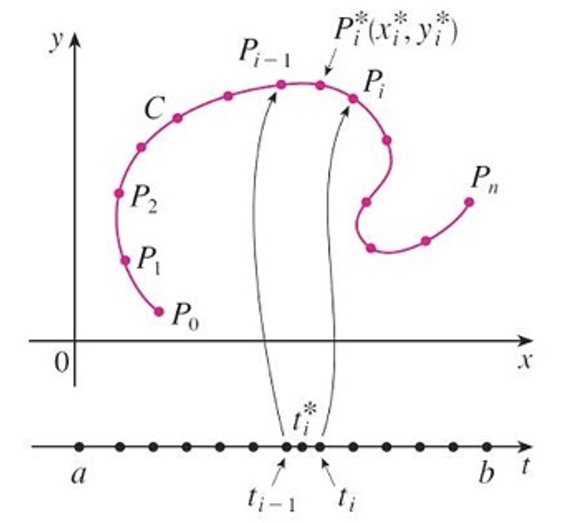

# Vector Calculus

## Vector Fields

### Vector Field in $\R^2$ and $\R^3$

**Definition**: Let $D$ be a set in $\R^2$ (a plane region). A **vector field on** $\R^2$ is a function $\boldsymbol{F}$ that assigns to each point $(x,y)$ in $D$ a two-dimensional vector $\boldsymbol{F}(x,y)$.

The best way to picture a vector field is to draw the arrow representing the vector $\boldsymbol{F}(x,y)$ starting at the point $(x,y)$. Since $\boldsymbol{F}(x,y)$ is a two-dimentional vector, we can write it in terms of its **component functions** $P$ and $Q$ as follows:
$$
\boldsymbol{F}(x,y)=P(x,y)\boldsymbol{i}+Q(x,y)\boldsymbol{j}=\left\langle P(x,y),Q(x,y) \right\rangle
\\[5pt]
\boldsymbol{F}=P\boldsymbol{i}+Q\boldsymbol{j}
$$
Notice that $P$ and $Q$ are scalar functions of two variables and are sometimes called **scalar fields** to distinguish them from vector fields. 

**Definition**: Let $E$ be a subset of $\R^3$. A **vector field on** $\R^3$ is a function $\boldsymbol{F}$ that assigns to each point $(x,y,z)$ in $E$ a three-dimentional vector $\boldsymbol{F}(x,y,z)$.

We can express it in terms of its component functions $P,Q,R$ as
$$
\boldsymbol{F}(x,y,z)=P(x,y,z)\boldsymbol{i}+Q(x,y,z)\boldsymbol{j}+R(x,y,z)\boldsymbol{k}
$$
As with the vector functions, we can define continuity of vector fields and show that $\boldsymbol{F}$ is continuous if and only if its component functions $P,Q,R$ are continuous.  We sometimes identify a point $(x,y,z)$ with its position vector $\boldsymbol{x}=\langle x,y,z \rangle$ and write $\boldsymbol{F}(\boldsymbol{x})$ instead of $\boldsymbol{F}(x,y,z)$. Then $\boldsymbol{F}$ becomes a function that assigns a vector $\boldsymbol{F}(\boldsymbol{x})$ to a vector $\boldsymbol{x}$

### Gradient Fields

If $f$ is a scalar function of two variables, we know that its gradient $\nabla f$ (or $\mathrm{grad}\;f$) is defined by
$$
\nabla f(x,y)=f_x(x,y)\boldsymbol{i}+f_y(x,y)\boldsymbol{j}
$$
Therefore $\nabla f$ is really a vector field on $\R^2$ and is called a **gradient vector field**. Likewise, if $f$ is a scalar function of three variables, its gradient is a vector field on $\R^3$ given by
$$
\nabla f(x,y,z)=f_x(x,y,z)\boldsymbol{i}+f_y(x,y,z)\boldsymbol{j}+f_z(x,y,z)\boldsymbol{k}
$$
A vector filed $\boldsymbol{f}$ is called a **conservative vector field** if it is the gradient of some scalar function, that is, if there exists a function $f$ such that $\boldsymbol{F}=\nabla f$. In this situation $f$ is called a **potential function** for $\boldsymbol{F}$. Not all vector fields are conservative, but such fields do arise frequently in physics.

## Line Integrals

In this section we define an integral that is similar to a single integral except that instead of integrating over an interval $[a,b]$, we integrate over a curve $C$. Such integrals are called line integrals, although “curve integrals" would be better terminology.
They were invented in the early 19th century to solve problems involving fluidflow, forces, electricity, and magnetism.

### Line Integrals in the Plane

We start with a plane curve $C$ given by the parametric equations
$$
x=x(t)\quad y=y(t)\quad a\le t\le b
$$
or, equivalently, by the vector equation $\boldsymbol{r}(t)=x(t)\boldsymbol{i}+y(t)\boldsymbol{j}$, and we assume taht $C$ is a smooth curve. 

If we divide the parameter interval $[a,b]$ into $n$ subintervals $[t_{i-1},t_i]$ of equal width and we let $x_i=x(t_i)$, and $y_i=y(t_i)$, then the corresponding points $P_i(x_i,y_i)$ divide $C$ into $n$ subjarcs with lengths $\Delta s_1,\Delta s_2,\ldots,\Delta s_n$.

We choose any point $P_i^*(x_i^*,y_i^*)$ in the $i$-th subjarc. (This corresponds to a point $t_j^*$ in $[t_{j-1},t_j]$). Now if $f$ fis any function of two variables whose domain includes the curve $C$, we evaluate $f$ at the point $(x_i^*,y_i^*)$, multiply by the length $\Delta s_i$ of the subarc, and form the sum
$$
\sum_{i=1}^{n}f(x_i^*,y_i^*)\Delta s_i
$$
which is similar to a Riemann sum.

**Definition**: If $f$ is defined on a smooth curve $C$, then the **line integral of $f$ along $C$** is
$$
\int_cf(x,y)ds=\lim_{n\to\infin}\sum_{i=1}^{n}f(x_i^*,y_i^*)\Delta s_i
$$
if this limit exists. 

We have found that the length of $C$ is
$$
L=\int_a^b\sqrt{\left( \frac{dx}{dt} \right)^2+\left( \frac{dy}{dt} \right)^2}dt
$$
A similar type of argument can be used to show that if $f$ is a continuous function, then the limit always exists and the following formula can be used to evaluate the line integral:
$$
\int_cf(x,y)ds=\int_a^bf(x(t),y(t))\sqrt{\left( \frac{dx}{dt} \right)^2+\left( \frac{dy}{dt} \right)^2}dt
$$
The value of the line integral does not depend on the parametrization of the curve, provided that the curve is traversed exactly once as $t$ increases from $a$ to $b$.

Suppose now that $C$ is a **piecewise-smooth curve**; that is, $C$ is a union of a finite number of smooth curves $C_1,C_2,\dots,C_n$, where the initial point of $C_{i+1}$ is the terminal point of $C_i$. Then we define the integral of $f$ along $C$ as the sum of the integrals of $f$ along each of the smooth pieces of $C$:
$$
\int_Cf(x,y)ds=\sum_{i=1}^{n}\int_{C_i}f(x,y)ds
$$
The **mass** $m$ of the wire:
$$
m=\lim_{n\to\infin}\sum_{i=1}^{n}\rho(x_i^*,y_i^*)\Delta s_i=\int_C\rho(x,y)ds
$$
The **center of mass** of the wire with density function $\rho$ is located at the point $(\bar{x},\bar{y})$, where
$$
\bar{x}=\frac{1}{m}\int_Cx\rho(x,y)ds
\\[5pt]
\bar{y}=\frac{1}{m}\int_Cy\rho(x,y)ds
$$

### Line Integrals with Respect to $x$ or $y$

The **line integrals of $f$ along $C$ with respect to $x$ and $y$**:
$$
\int_Cf(x,y)dx=\lim_{n\to\infin}\sum_{i=1}^{n}f(x_i^*,y_i^*)\Delta x_i=\int_a^bf(x(t),y(t))x'(t)dt
\\[5pt]
\int_Cf(x,y)dy=\lim_{n\to\infin}\sum_{i=1}^{n}f(x_i^*,y_i^*)\Delta y_i==\int_a^bf(x(t),y(t))y'(t)dt
$$

In particular, we often need to parametrize a line segment, so it's useful to remember that a vector representation of the line segment that starts at $\boldsymbol{r}_0$ and ends at $\boldsymbol{r}_1$ is given by
$$
\boldsymbol{r}(t)=(1-t)\boldsymbol{r}_0+t\boldsymbol{r}_1\quad 0\le t\le1
$$
In general, a given parametrization $x=x(t),y=y(t),a\le t\le b$, determines an **orientation** of a curve $C$, with the positive direction corresponding to increasing values of the parameter $t$. If -C denotes the curve consisting of the same points as $C$ but with the opposite orientation, then we have
$$
\int_{-C}f(x,y)dx=-\int_Cf(x,y)dx
\\[5pt]
\int_{-C}f(x,y)dy=-\int_Cf(x,y)dy
$$
But if we integrate with respect to arc length, the value of the line integral does not change when we reverse the orientation of the curve:
$$
\int_{-C}f(x,y)ds=\int_Cf(x,y)ds
$$
This is because $\Delta s_i$ is always positive, whereas $\Delta x_i$ and $\Delta y_i$ change sign when we reverse the orientation of $C$.

### Line Integrals in Space

We evaluate it using a formula similar to the line integrals in plane
$$
\begin{aligned}
\int_Cf(x,y,z)ds&=\int_a^bf(x(t),y(t),z(t))\sqrt{\left( \frac{dx}{dt} \right)^2+\left( \frac{dy}{dt} \right)^2+\left( \frac{dz}{dt} \right)^2}dt
\\[5pt]
&=\int_a^bf(\boldsymbol{r}(t))|\boldsymbol{r}'(t)|dt
\end{aligned}
$$
Similarly, Line integrals along $C$ with respect to $x,y,z$ can also be defined. 
$$
\int_Cf(x,y,z)dx=\int_a^bf(x(t),y(t),z(t))x'(t)dt
\\[5pt]
\int_Cf(x,y,z)dy=\int_a^bf(x(t),y(t),z(t))y'(t)dt
\\[5pt]
\int_Cf(x,y,z)dz=\int_a^bf(x(t),y(t),z(t))z'(t)dt
$$
Therefore, as with line integrals in the plane, we evaluate integrals of the form
$$
\int_CP(x,y,z)dx+Q(x,y,z)dy+R(x,y,z)dz
$$
by expressing everything $(x,y,z,dx,dy,dz)$ in terms of the parameter $t$.

### Line Integrals of Vector Fields; Work

We know that the work done by a variable force $f(x)$ in moving a particle from $a$ to $b$ along the $x$-axis is $W=\int_a^bf(x)dx$. Then we have found that the work done by a constant force $\boldsymbol{F}$ in moving an object from a point $P$ to another point $Q$ in space is $W=\boldsymbol{F}\cdot\boldsymbol{D}$, where $\boldsymbol{D}=\vec{PQ}$ is the displacement vector.

We can divide the curve $C$ into subarcs $P_{i-1}P_i$ with lengths $\Delta s_i$ by dividing the parameter interval $[a,b]$ into subintervals of equal width. Thus the work done by the force $\boldsymbol{F}$ in moving the particle from $P_{i-1}$ to $P_i$ is approximately
$$
\boldsymbol{F}(x_i^*,y_i^*,z_i^*)\cdot\left[ \Delta s_i\boldsymbol{T}(t_i^*) \right]=\left[ \boldsymbol{F}(x_i^*,y_i^*,z_i^*)\cdot\boldsymbol{T}(t_i^*) \right]\Delta s_i
$$
and the total work done in moving the particle along $C$ is approximately
$$
\sum_{i=1}^{n}\left[ \boldsymbol{F}(x_i^*,y_i^*,z_i^*)\cdot\boldsymbol{T}(x_i^*,y_i^*,z_i^*) \right]\Delta s_i
$$
where $\boldsymbol{T}(x,y,z)$ is the unit tangent vector at the point $(x,y,z)$ on $C$.

Therefore we define the **work** $W$ done by the force field $\boldsymbol{F}$ as the limit of the Riemann sums, namely
$$
W=\int_C\boldsymbol{F}(x,y,z)\cdot\boldsymbol{T}(x,y,z)ds=\int_C\boldsymbol{F}\cdot\boldsymbol{T}ds
$$
If the curve $C$ is given by the vector equation
$$
\boldsymbol{r}(t)=x(t)\boldsymbol{i}+y(t)\boldsymbol{j}+z(t)\boldsymbol{k}
$$
then $\boldsymbol{T}(t)=\frac{\boldsymbol{r}'(t)}{|\boldsymbol{r}'(t)|}$, so we can rewrite the equation in the form
$$
W=\int_a^b\left[ \boldsymbol{F}(\boldsymbol{r}(t))\cdot\frac{\boldsymbol{r}'(t)}{|\boldsymbol{r}'(t)|} \right]|\boldsymbol{r}'(t)|dt=\int_a^b\boldsymbol{F}(\boldsymbol{r}(t))\cdot\boldsymbol{r}'(t)dt
$$
This integral is often abbreviated as $\int_C\boldsymbol{F}\cdot d\boldsymbol{r}$.

**Definition**: Let $\boldsymbol{F}$ be a continuous vector field vector field defined on a smooth curve $C$ given by a vector function $\boldsymbol{r}(t)$, $a\le t\le b$. Then the **line integral of $F$ along $C$** is
$$
\int_C\boldsymbol{F}\cdot d\boldsymbol{r}=\int_a^b\boldsymbol{F}(\boldsymbol{r}(t))\cdot\boldsymbol{r}'(t)dt=\int_C\boldsymbol{F}\cdot\boldsymbol{T}ds
$$
